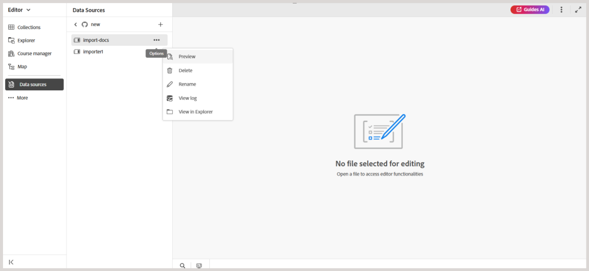

# 使用Git连接器导入内容

>[!NOTE]
>
> 默认情况下，此功能处于禁用状态。 要在您的环境中启用它，请联系您的客户成功团队。

Git Connector允许您[将内容从连接的Git存储库导入Experience Manager Guides](#import-content-from-the-connected-git-repository)。 导入内容后，您可以使用Experience Manager Guides创作、审阅、翻译和发布功能来开发和交付文档。

当源存储库中的内容发生更改时，您可以重新获取更新、查看冲突并与Experience Manager Guides同步最新更改。

## 主要功能

Git Connector允许作者将内容直接从Git存储库拉入Experience Manager Guides，而无需手动传输文件。 配置完毕后，作者即可访问以下功能。

**内容摄取**

- 将任何Git存储库（公共或专用）中的文件同步到Experience Manager Guides中。
- 按源文件夹路径进行筛选，以摄取单个子目录而不是整个存储库。
- 使用`gitignore-aware`规则引擎自动跳过`.gitignore`模式或自定义规则排除的文件。
- 在重新同步时保留GUID，以便在更新后保持现有DITA交叉引用不变。

**增量（增量）同步**

- 跟踪上次同步的提交，并仅提取在后续同步时添加、修改或删除的文件，而不是重新导入整个存储库。
- 在导入之前，生成一个增量报告，列出每个已更改的文件及其更改类型。
- 无论存储库大小如何，都能保持一致的提取时间。 有关基准数据，请查看[性能基准](#performance-benchmarks)。

## Git Connector的工作原理

下图显示了Git Connector如何将内容从源存储库移动到Experience Manager Guides中。

Git Connector将内容从Git存储库移动到Experience Manager Guides中四个阶段：

1. **抓取并同步**：爬虫连接到您配置的Git存储库和配置文件，并根据需要将内容同步到连接器。
1. **摄取并检测冲突**：传入文件将根据Experience Manager Guides中的现有内容进行扫描和哈希处理。 没有冲突更改的文件会自动移动；具有冲突更改的文件将被标记以供手动解决。
1. **Persist**：已解析的内容会与您的其他Experience Manager Guides内容一起处理并保存到AEM中。
1. **Experience Manager Guides工作流程**：一旦保留，该内容将像任何其他Experience Manager Guides内容一样可用于创作、审阅、翻译和发布。

## 性能指标评测

以下基准测试显示随着存储库规模的扩大，在Experience Manager as a Cloud Service上执行完整（非增量）的&#x200B;**批量导入程序**&#x200B;同步时间。

| 缩放 | 获取时间 | 导入时间 | 总时间 | 批次 | 吞吐量 |
|---|---|---|---|---|---|
| 1,000个文件 | 1分53秒 | 3分30秒 | 5分29秒 | 10 × 100 | ~286个文件/分钟 |
| 5,000个文件 | 1分55秒 | 18分21秒 | 20分27秒 | 20 × 250 | ~273个文件/分钟 |
| 10,000个文件 | 1分39秒 | 36分22秒 | 37分24秒 | 40 × 250 | ~267个文件/分钟 |
| 50,000文件 | 1分25秒 | 2小时43分钟 | 2小时58分钟 | 200 × 250 | ~270个文件/分钟 |

## 使用Git连接器导入内容

管理员在Experience Manager Guides中配置Git连接器后，您可以从编辑器中使用它从Git存储库导入内容。

## 先决条件

在开始使用此功能之前，请确保：

- 必须为环境启用Git连接器功能。
- （*如果启用*）管理员已在您的环境中配置了Git连接器。 有关详细信息，请通过用户界面](../install-conf-guide/conf-git-connector.md)查看[创建和配置Git连接器。
- 您对包含要导入的内容的Git存储库具有&#x200B;*读取*&#x200B;访问权限。
- 您知道要导入哪个存储库分支和源文件夹。
- 您知道Experience Manager Guides中将存储导入内容的目标文件夹。

## 从连接的Git存储库导入内容

执行以下步骤可从Git存储库导入内容：

1. 在编辑器中，打开左侧面板。
1. 选择&#x200B;**数据源**。

   将显示连接的数据源。

1. 选择&#x200B;**Git Connector**&#x200B;磁贴。

1. 选择+图标，然后选择&#x200B;**批量导入程序**。

   显示&#x200B;**批量导入程序**&#x200B;对话框。

   

1. 在&#x200B;**批量导入程序**&#x200B;对话框中，提供导入的名称，从配置的Git存储库中选择一个子文件夹，然后选择&#x200B;**保存并提取**。  可导入的文件列表显示在对话框中。 在继续之前，请查看列表并验证内容。

   

1. 查看文件后，选择&#x200B;**全部导入**&#x200B;以将内容导入Experience Manager Guides。

   >[!NOTE]
   >
   > 您可以启用&#x200B;**自动同步**&#x200B;以自动同步内容并将内容从Git存储库导入到Experience Manager Guides中。 如果检测到任何错误，则不会触发自动同步，作者必须通过选择&#x200B;**全部导入**&#x200B;来手动导入内容。 启用后，无法为导入程序禁用自动同步。

导入内容后，在设置Git Connector时，该内容存储在配置的&#x200B;**Target AEM根路径**&#x200B;下。

## 管理Git导入的内容

将内容导入Experience Manager Guides后，您可以使用可用的操作来管理内容并将其与源存储库中的更改保持同步。

{width="600"}

- **预览**：预览导入的内容。 如果源存储库包含更新，请查看差异，并使用&#x200B;**Refetch**&#x200B;选项导入最新更改。 如果差异需要合并，请查看[解决Git连接器冲突](#review-and-resolve-content-conflicts)。
- **删除**：删除不再需要的导入程序。
- **重命名**：重命名导入程序以便于识别。
- **查看日志**：查看导入日志以查看导入操作的详细信息。
- **查看报告**：查看并下载&#x200B;**批量导入报告**，其中包括详细信息，例如：

  - 导入的文件总数
  - 成功导入的次数
  - 失败的导入数

  {width="600"}

  您还可以下载详细报告。 如果某些文件无法导入，请使用&#x200B;**重试失败的导入**&#x200B;以尝试再次导入它们。

## 查看并解决内容冲突

从Git存储库重新获取内容时，存储库版本与Experience Manager Guides中可用的相应内容之间的内容差异显示为冲突。 将数据导入Experience Manager Guides之前，必须解决并合并此类冲突。

执行以下步骤以解决和合并冲突：

1. 打开批量导入程序对话框，然后选择&#x200B;**重新获取**。
1. 如果检测到冲突，**需要合并**&#x200B;选项卡会出现，并列出包含冲突的文件。 选择&#x200B;**需要合并**&#x200B;选项卡，然后从列表中选择文件以查看和解决冲突。
1. 对于有冲突的文件，将显示三向合并视图。

   

   左窗格(**AEM**)显示AEM存储库中的当前内容，右窗格(**GIT**)显示远程Git存储库中的传入内容。 中间窗格(**Result**)最初用AEM存储库内容填充，并用作合并编辑器，解决冲突。 最终合并的结果将生成并显示在此中间窗格中。

1. 查看编辑器中突出显示的差异，并使用合并控件解决冲突：

   - 如果要使用Git存储库中的最新更改，请确保选中&#x200B;**GIT**&#x200B;分区中冲突的复选框，然后选择相应的`<<<`控件。 选定的Git内容替换了&#x200B;**结果**&#x200B;分区中的冲突内容。

     

   - 如果要保留两个版本中的内容，请清除该冲突的复选框，然后使用`<<<`控件将所需内容添加到&#x200B;**结果**&#x200B;部分，而不替换现有内容。

     

   - 同样，您可以使用AEM部分中的`>>>`控件以保持Experience Manager Guides中的当前版本可用。

1. 查看合并内容后，请执行下列操作之一：

   - 使用&#x200B;**接受AEM**&#x200B;将&#x200B;**结果**&#x200B;分区中的内容完全替换为&#x200B;**AEM**&#x200B;分区的版本，并保留您的本地更改。
   - 使用&#x200B;**接受GIT**&#x200B;将&#x200B;**结果**&#x200B;节中的内容完全替换为&#x200B;**GIT**&#x200B;节中的版本，并保持存储库更改。

无论您使用上面哪个选项，**必须完全合并**。 选择它会将当前的&#x200B;**结果**&#x200B;内容锁定为该文件的解析版本，并将该文件标记为已合并。

将包含冲突的所有文件标记为合并后，将启用&#x200B;**全部导入**&#x200B;按钮。 选择&#x200B;**全部导入**&#x200B;以完成解决冲突的过程。

如果文件在Git存储库中发生更改，但尚未在Experience Manager Guides中修改，则无需合并。 此类文件自动包含在&#x200B;**清理更新**&#x200B;中，可以直接导入。

{width="600"}