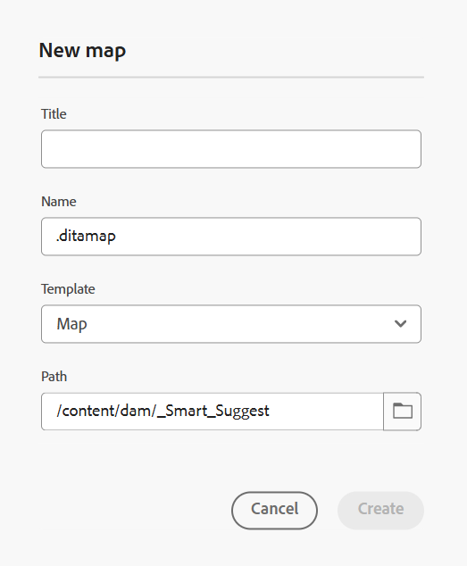

# 编辑器中的左侧面板

通过左侧面板，可快速访问收藏集、存储库视图、映射视图等功能。 您可以通过选择位于界面左下角的&#x200B;**展开**&#x200B;图标来展开面板。 展开后，使用&#x200B;**折叠**&#x200B;图标折叠面板。 在展开视图中，它显示在折叠视图中作为工具提示显示的图标的名称。

>[!NOTE]
>
> 左侧面板可调整大小。 要调整面板的大小，将光标置于面板边界上，光标将变为双向箭头，选择并拖动以调整面板宽度。

通过左面板可访问以下功能：

- [收藏集](#collections)
- [存储库](#repository)
- [地图](#map)
- [可重用内容](#reusable-content)
- [大纲](#outline)

左侧面板中的某些功能在&#x200B;**更多**&#x200B;部分下可用。 选择“更多”图标以访问以下功能：

- [术语表](#glossary)
- [条件](#conditions)
- [主题方案](#subject-scheme)
- [代码片段](#snippets)
- [模板](#templates)
- [引用](#citations)
- [语言变量](#language-variables)
- [变量](#variables)
- [查找并替换](#find-and-replace)
- [PDF模板](#pdf-templates)
- [审阅](#review)


如果配置了Adobe Workfront，则左侧面板中还会显示一个标记为&#x200B;**Workfront**&#x200B;的附加选项。

有关详细信息，请查看[Workfront集成](./workfront-integration.md)。

>[!NOTE]
>
> 左侧面板中可用的功能由您的管理员管理，允许他们启用或禁用左侧面板中存在的单个功能。 左侧面板中仅显示已启用的功能。 有关更多详细信息，请查看&#x200B;**选项卡栏**&#x200B;的[面板](./web-editor-tab-bar.md)部分。

左侧面板功能的详细说明如下：

## 收藏集

如果您使用一组文件或文件夹，则可以将它们添加到收藏夹列表以快速访问它们。 **收藏集**&#x200B;显示您已添加的文档列表以及其他用户可公开访问的文档列表。

默认情况下，您可以按标题查看文件。 当您将鼠标悬停在文件上时，您可以作为工具提示查看文件标题和文件路径。

>[!NOTE]
>
> 作为管理员，您还可以选择在编辑器中按文件名查看文件列表。 在&#x200B;**用户首选项**&#x200B;中选择&#x200B;**编辑器文件显示配置**&#x200B;节的&#x200B;**文件名**&#x200B;选项。

<details>
    <summary> 新建收藏集 </summary>


要创建新收藏集，请选择“收藏集”面板旁边的+图标以显示&#x200B;**新建收藏集**&#x200B;对话框：

{width="300" align="left"}

为要创建的收藏集输入标题和描述。 如果选择&#x200B;**公共**，则其他用户可以看到此收藏夹。

>[!NOTE]
>
> 您还可以从Experience Manager Guides主页创建收藏集。 打开主页，导航到&#x200B;**概述部分**&#x200B;中的[收藏集](./intro-home-page.md#overview)构件，然后选择&#x200B;**新建收藏集**。

</details>

<details>
    <summary> 将文件添加到收藏集 </summary>


要将文件添加到收藏集，请使用以下任一方法：

- 导航到“存储库”视图中所需的文件或文件夹，选择&#x200B;*选项*&#x200B;图标以打开上下文菜单，然后选择&#x200B;**添加到** > **收藏集**。 在&#x200B;**添加到收藏集**&#x200B;对话框中，您可以选择将文件/文件夹添加到现有收藏夹或创建新收藏夹。

  {width="300" align="left"}

- 在编辑器中右键单击文件的选项卡以打开上下文菜单。 选择&#x200B;**添加到** > **收藏集**&#x200B;以将文件添加到收藏夹列表。

  {align="left"}


>[!NOTE]
>
> - 要从收藏夹列表中删除项目，请选择收藏夹收藏中该项目旁边的“选项”图标，然后选择&#x200B;**从收藏夹中删除**。
> - 要预览文件而不打开它，请选择一个文件，然后从“选项”菜单中选择“预览”**&#x200B;**。

</details>

收藏集的&#x200B;**选项菜单**

您还可以使用可用于收藏集的“选项”菜单执行许多操作：

{width="650" align="left"}

- **重命名**：重命名选定的收藏集。
- **删除**：删除选定的收藏集。
- **刷新**：从存储库中获取新的文件和文件夹列表。
- **在Assets UI中查看**：在Assets UI中显示文件或文件夹内容。

>[!NOTE]
>
> 您可以使用顶部的&#x200B;**刷新**&#x200B;图标刷新列表。 此外，刷新列表会重新加载收藏集，因此，面板中的任何展开收藏集都会折叠。


## 存储库

当您选择“存储库”图标时，您将获得DAM中可用的文件和文件夹的列表。 默认情况下，您可以按标题查看文件。 当您将鼠标悬停在文件上时，您可以作为工具提示查看文件标题和文件名。

>[!NOTE]
>
> 作为管理员，您还可以选择在编辑器中按文件名查看文件列表。 在&#x200B;**用户首选项**&#x200B;中选择&#x200B;**编辑器文件显示配置**&#x200B;节的&#x200B;**文件名**&#x200B;选项。

一次加载75个文件。 每次选择&#x200B;**加载更多**...将加载75个文件，并且列出所有文件后按钮将停止显示。 批量加载非常高效，与加载文件夹中存在的所有文件相比，您可以更快地访问文件。

您可以轻松地导航到DAM中所需的文件，并在编辑器中打开它。 如果您具有编辑文件所需的访问权限，则可以这样做。

您还可以在编辑器中选择和播放音频或视频文件。 您可以更改卷或
视频的视图。 在快捷菜单中，您还可以选择下载、更改播放
速度，或查看画中画。

选择一个映射，然后按Enter或双击以在&#x200B;**映射视图**&#x200B;中打开它。 有关更多详细信息，请在左侧面板中查看&#x200B;**映射视图**&#x200B;功能描述。 选择一个主题并按Enter键或双击以在[内容编辑区域](./web-editor-content-editing-area.md)中将其打开。 能够直接从编辑器中导航和打开文件可节省时间并提高生产效率。

**在存储库中筛选搜索**

编辑器为搜索文本提供了增强的过滤器。 您可以搜索和筛选位于Adobe Experience Manager存储库选定路径上的文件中的文本。 它搜索文件中的标题、文件名和内容。


{width="300" align="left"}

*应用筛选器以搜索包含文本`personal spaceship.`*&#x200B;的文件

选择&#x200B;**筛选器搜索** \（\）图标以打开筛选器弹出窗口。

>[!NOTE]
>
> 当您搜索任何文本或筛选任何文件时，**筛选搜索** \（\）图标上会显示一个蓝色圆点，表示我们位于搜索面板上，并且已应用某些筛选器。


您可以使用以下选项来筛选文件，并在Adobe Experience Manager存储库中缩小搜索范围：

- **DITA文件**：您可以查找所选路径中存在的所有&#x200B;**DITA主题**&#x200B;和&#x200B;**DITA映射**。 默认情况下，将选择这些选项。
- **非DITA文件**：您可以在所选路径中搜索&#x200B;**Ditaval文件**、**图像文件**、**多媒体**、**文档**&#x200B;和&#x200B;**JSON**。

   {width="300" align="left"}

  *使用快速过滤器搜索 DITA 和非 DITA 文件。*

>[!NOTE]
>
> 您还可以使用&#x200B;**DITA主题**&#x200B;筛选器在存储库中搜索特定于Markdown文件的内容，包括标题、主题内容和属性。 此功能当前仅适用于新创建的Markdown文件。

**高级筛选**

选择&#x200B;**高级筛选** 图标以查看&#x200B;**高级筛选**&#x200B;对话框。

您可以在&#x200B;**常规**&#x200B;和&#x200B;**高级**&#x200B;选项卡下查看以下选项。

 {width="650" align="left"}


**常规**

- **搜索结果，带有**：在Adobe Experience Manager存储库选定路径上的文件中搜索一些文本。 在文件的标题、文件名和内容中搜索文本。

这与存储库窗口中的搜索框同步。 例如，如果在存储库面板的搜索框中键入`general purpose`，则它也会出现在&#x200B;**高级筛选器**&#x200B;对话框中，反之亦然。

- **在**&#x200B;中搜索：选择要搜索Adobe Experience Manager存储库中文件的路径。
- **DITA文件**：您可以查找所选路径中存在的所有&#x200B;**DITA主题**&#x200B;和&#x200B;**DITA映射**。 默认情况下，将选择这些选项。
- **非DITA文件**：您可以在所选路径中搜索&#x200B;**Ditaval文件**、**图像文件**、**多媒体**、**文档**&#x200B;和&#x200B;**JSON**。
- **锁定者**：显示用户列表。 该列表以异步方式分页并加载，一次显示一组有限的用户，并在滚动或导航时获取更多内容。 这提高了加载速度和整体性能，尤其是在处理大量用户时。
- **修改于**&#x200B;之后/**修改于**&#x200B;之前：根据修改日期筛选内容。 从日历中选择一个日期范围或选择以下时间范围选项之一：
   - 在过去的两个小时内
   - 在上周
   - 在上个月
   - 在去年
- **标记**：根据标记筛选内容。

**高级**

- **DITA元素**：您还可以搜索指定DITA元素的属性中的特定值。
   - 选择&#x200B;**添加元素**&#x200B;以添加元素、属性和值。
   - 应用已选择的过滤器。

- 选择&#x200B;**全部清除**&#x200B;以清除所有应用的筛选器。


- 选择&#x200B;**关闭筛选器** 图标以关闭筛选器并返回到存储库的树视图。

  >[!NOTE]
  >
  >系统管理员还可以配置文本过滤器，并显示或隐藏其他过滤器。 有关更多详细信息，请参阅安装和配置Adobe Experience Manager Guides as a Cloud Service中的&#x200B;*配置文本过滤器*&#x200B;部分。
  >
  >将显示包含搜索文本的已过滤文件的列表。 例如，包含文本`personal spaceship`的文件将列在上一个屏幕快照中。 您可以从筛选列表中选择多个文件以将其拖放到打开进行编辑的映射中。

**选项菜单**

除了从左侧面板打开文件外，您还可以使用“存储库”视图中提供的“选项”菜单执行许多操作。 根据您选择的是文件夹、主题文件还是介质文件，您可以查看不同的选项。

文件夹的&#x200B;**选项**

您可以使用存储库视图中&#x200B;*文件夹*&#x200B;的“选项”菜单执行以下操作：

{width="550" align="left"}


- **新建**：创建新的DITA主题、DITA映射或文件夹。

<details>
    <summary> 创建新主题的步骤 </summary>

创建新主题的步骤：
1. 选择&#x200B;**新建** > **主题**。
2. 显示&#x200B;**新建主题**&#x200B;对话框。

   {width="300" align="left"}

3. 在&#x200B;**新建主题**&#x200B;对话框中，提供以下详细信息：
   - 主题的标题。
   - \（可选\）*主题的文件名。 根据主题“标题”自动建议文件名。 如果管理员启用了基于UUID设置的自动文件名，则您将不会查看名称字段。
   - 主题所基于的模板。 例如，对于现成的设置，您可以从空白、概念、DITAVAL、引用、任务、主题、Markdown、术语表和故障排除模板中进行选择。 如果您的文件夹配置了文件夹配置文件，则您将仅查看在文件夹配置文件中配置的主题模板。

   - 要保存主题文件的路径。 默认情况下，存储库中当前选定文件夹的路径将显示在路径字段中。
4. 选择&#x200B;**创建**。该主题在指定的路径中创建。 此外，该主题将在编辑器中打开以进行编辑。

</details>

<details>
<summary> 创建新DITA映射的步骤 </summary>


创建新DITA映射的步骤：

1. 选择&#x200B;**新建** > **DITA映射**。
2. 显示&#x200B;**新建映射**&#x200B;对话框。

   {width="300" align="left"}

3. 在&#x200B;**新建映射**&#x200B;对话框中，提供以下详细信息：
   - 地图的标题。
   - *\（可选\）*&#x200B;映射的文件名。 根据地图标题自动建议文件名。 如果管理员启用了基于UUID设置的自动文件名，则您将不会查看名称字段。
   - 映射所基于的模板。 例如，对于现成的设置，您可以从Bookmap或DITA映射模板中进行选择。
   - 保存映射文件的路径。 默认情况下，存储库中当前选定文件夹的路径将显示在路径字段中。
4. 选择&#x200B;**创建**。将在路径字段中指定的文件夹中创建并添加映射。 此外，该映射将在“映射”视图中打开。 可以在映射编辑器中打开映射文件并向其中添加主题。 有关将主题添加到映射文件的详细信息，请查看[创建映射](map-editor-create-map.md#)。 或者，选择&#x200B;**在地图控制台中打开**&#x200B;以在地图控制台中打开该地图。
</details>

<details>
<summary> 创建新文件夹的步骤 </summary>

创建新文件夹的步骤：

1. 选择&#x200B;**新建** > **文件夹**。
2. 将显示&#x200B;**新文件夹**&#x200B;对话框。

   {width="300" align="left"}

3. 在&#x200B;**新建文件夹**&#x200B;对话框中，提供以下详细信息：
   - 文件夹的标题，将自动转换为文件夹名称。
   - 要保存文件夹的路径。 默认情况下，存储库中当前选定文件夹的路径将显示在路径字段中。
4. 选择&#x200B;**创建**。将在执行“创建文件夹”选项的文件夹中创建并添加文件夹。

</details>

- **上传Assets**：将文件从本地系统上传到Adobe Experience Manager存储库中的选定文件夹。 您还可以将文件从本地系统拖放到当前工作主题上。 如果要将本地系统中的图像插入主题，这非常有用。

  {width="300" align="left"}

  您可以选择要上载文件的文件夹，并且还会显示图像预览。 如果要重命名文件，可以在“文件名”文本框中执行此操作。 选择&#x200B;**上传**&#x200B;以完成文件上传过程。 如果您在某个主题上拖放了图像文件，则该图像文件会添加到文章中，并且也会上传。

  如果您的管理员在&#x200B;*XMLEditorConfig*&#x200B;中启用了UUID选项，则您将在&#x200B;**Source**&#x200B;属性中查看已上传图像的UUID。

  {align="left"}

- **在文件夹中查找文件**：将焦点转移到可在其中输入搜索词的存储库搜索。 搜索在存储库中的选定文件夹下执行。 也可以应用过滤器返回DITA文件和/或图像文件。

  {width="300" align="left"}

  您也可以使用文件的UUID进行搜索。 在这种情况下，搜索结果显示DITA/XML文件的标题，如果文件是图像文件，则显示文件的UUID。 在下面的搜索示例中，搜索图像文件的UUID，搜索结果显示原始图像文件的UUID和引用该图像的文件的主题标题。

  {width="300" align="left"}

- **折叠**：折叠存储库中的选定文件夹。

  >[!NOTE]
  >
  > 使用文件夹旁边的&#x200B;**\>**&#x200B;图标展开该文件夹。

- **添加到收藏集**：将选定的文件夹添加到收藏夹。 您可以选择将其添加到现有收藏集或新收藏集。

- **刷新**：从存储库中获取新的文件和文件夹列表。
- **在Assets UI中查看**：在Assets UI中显示文件夹内容。

**文件选项**

根据您选择的是介质文件还是DITA文件，获取对“选项”菜单中不同选项的访问权限。 一些可用于介质和DITA文件的常用选项包括：

- 编辑
- 在FrameMaker中打开
- 复制
- 锁定/解锁
- 预览
- 移到
- 重命名
- 删除
- 生成
- 下载为PDF
- 添加至
- 复制
- 在Assets UI中查看
- 属性


存储库视图中文件的{width="550" align="left"}

“选项”菜单中的各种选项说明如下：

- **编辑**：打开文件进行编辑。 对于.ditamap/.bookmap文件，将在[映射编辑器](map-editor-advanced-map-editor.md#)中打开该文件以进行编辑。

- **重复**：使用此选项创建所选文件的重复或副本。 您还可以选择在重复资产提示符下重命名重复的文件。 默认情况下，创建文件时使用的后缀\（如filename\_1.extension\）。 文件的标题与源文件相同，新文件从版本1.0开始。复制所有引用、标记和元数据，但基线不会复制到重复文件中。
- **锁定**：获取选定文件的锁定以进行编辑。 如果文件已锁定，将鼠标指针悬停在锁定图标上会显示锁定文件&#x200B;**。如果您已锁定文件，则显示锁定文件**；如果其他用户已锁定文件，则显示锁定文件&#x200B;**。锁定文件[用户名]**。

- **预览**：获取文件（.dita、.xml、音频、视频或图像）的快速预览而不打开它。 您可以调整预览窗格的大小。 如果内容包含任何`<xref>`或`<conref>`，您可以选择它以在新选项卡中打开它。 文件的标题将显示在窗口中。 如果不存在标题，则会显示文件名。 要关闭&#x200B;**预览**&#x200B;面板，您可以选择关闭图标，也可以选择窗格之外的任意位置。

  {align="left"}

- **重命名**：使用此选项重命名所选文件。 在&#x200B;**重命名资源**&#x200B;对话框中输入新文件的名称。
   - 您可以重命名任何类型的文件。
   - 无法更改文件的扩展名。
   - 两个文件的名称不能相同。 因此，不能将文件重命名为已存在的名称。 显示错误。

- **移动到**：使用此选项将所选文件移动到其他文件夹。
   - 您可以键入目标文件夹的名称，或选择&#x200B;**选择路径**&#x200B;以选择目标文件夹。
   - 您可以将任何类型的文件移动到“内容”文件夹中的任何目标。
   - 两个文件的名称不能相同。 因此，您不能将文件移动到具有相同名称的文件已存在的文件夹中。

  如果您尝试将文件移动到某个文件夹，而该文件夹中存在具有相同名称但标题不同的文件，则会显示“重命名和移动文件”对话框，并且您需要在移动文件之前重命名该文件。 目标文件夹中移动的文件具有新文件名。

  {width="550" align="left"}

  >[!NOTE]
  >
  > 您还可以将文件拖放到另一个目标文件夹中。

  **排除方案**

  在以下情况下，Experience Manager Guides不允许重命名或移动文件：

   - 如果文件是审阅或翻译工作流的一部分，则无法移动或重命名该文件。

   - 如果有任何其他用户锁定该文件，则无法重命名或移动该文件，则不会查看该文件的“重命名”或“移至”选项。

  >[!NOTE]
  >
  > 如果管理员已授予您文件夹权限，则仅显示&#x200B;**重命名**&#x200B;或&#x200B;**移至**&#x200B;选项。

  <details>
    <summary> 云服务 </summary>

  重命名或移动任何文件不会中断对该文件的所有现有引用，因为每个文件都有一个唯一的UUID。
  </details>

- **删除**：使用此选项删除所选文件。 删除文件之前会显示确认提示。

   - 删除文件之前会显示确认提示。
   - 如果文件未从任何其他文件引用，则会将其删除，并显示一条成功消息。
   - 如果文件被锁定，则无法删除该文件，并会显示一条错误消息。

     >[!NOTE]
     >
     > 如果管理员阻止删除锁定的文件，则只会显示错误消息。 有关更多详细信息，请参阅安装和配置Adobe Experience Manager Guides as a Cloud Service中的&#x200B;*阻止删除签出的文件*&#x200B;部分。

   - 如果文件已添加到收藏集，则会显示&#x200B;**强制删除**&#x200B;对话框，您可以强制删除它。
   - 如果该文件是从任何其他文件引用的，则会显示带有确认消息的&#x200B;**强制删除**&#x200B;对话框，您可以强制删除该文件：

     {width="300" align="left"}

     >[!NOTE]
     >
     > 如果管理员已授予文件删除权限，则启用&#x200B;**强制删除**。 否则，**强制删除**&#x200B;已禁用，并显示一条消息，指出您无权删除引用的文件。 有关更多详细信息，请参阅安装和配置Adobe Experience Manager Guides as a Cloud Service中的&#x200B;*阻止删除引用的文件*&#x200B;部分。

   - 如果删除了引用的主题并且打开了包含要编辑的引用的文件，则将显示被引用文件的断开链接。

  >[!NOTE]
  >
  > 也可以使用键盘的Delete键以类似方式删除所选文件。

- **复制**：您可以选择以下选项：

   - **复制UUID**：将所选文件的UUID复制到剪贴板。

   - **复制路径**：将所选文件的完整路径复制到剪贴板。

- **添加到**：您可以从以下选项中进行选择：
   - **收藏集**：将选定的文件添加到收藏集。 您可以选择将其添加到现有收藏集或新收藏集。

   - **可重用内容**：将所选文件添加到左侧面板中的“可重用内容”列表。

- **属性**：使用此项可打开所选文件的属性页。 也可以从Assets UI访问此属性页面，方法是选择文件，然后选择工具栏中的属性图标。

- **在映射仪表板中打开**：如果所选文件是DITA映射，则此选项将打开映射仪表板。

- **在映射控制台中打开**：如果所选文件是DITA映射，则此选项将打开映射控制台。

- **在氧气中编辑**：选择此选项可在氧气连接器插件中编辑所选文件。 将打开文件以进行编辑。

  >[!NOTE]
  >
  >请联系您的客户成功团队以在环境中启用此功能。 这并非开箱即用支持的一部分。 有关更多详细信息，请查看《安装和配置指南》中的[在氧中配置要编辑的选项](../cs-install-guide/conf-edit-in-oxygen.md)部分。


- **在Assets UI中查看**：使用此项在Assets UI中显示.dita/.xml文件的预览。 对于.ditamap/.bookmap文件，映射中的所有主题文件都以单个统一的逐页视图显示。

- **下载为PDF**：使用选项生成并下载PDF输出。

- **生成**：使用选项将映射或映射中的主题发布到站点页面、内容片段或体验片段。

## 地图

选择映射视图图标时，将显示映射视图，其中显示映射文件中主题的列表。 如果尚未打开任何映射文件，则“映射”视图将显示为空白。 双击任何映射文件将在此视图中打开映射文件。 您可以双击映射中的任意文件以在编辑器中打开它。

默认情况下，您可以按标题查看文件。 当您将鼠标悬停在文件上时，您可以作为工具提示查看文件标题和文件路径。

>[!NOTE]
>
>作为管理员，您还可以选择查看当前在映射视图中打开的父映射的文件名。 在&#x200B;**用户首选项**&#x200B;中选择&#x200B;**编辑器文件显示配置**&#x200B;节的&#x200B;**文件名**&#x200B;选项。


在地图视图中打开地图时，当前地图的标题显示在选项卡栏的中央。 如果标题太长，则会显示省略号，您还可以将鼠标悬停在标题上以查看工具提示中的完整标题。

为主题或映射引用定义键属性时，可在左侧面板中查看标题、相应图标和键。 键显示为`keys=<key-name>`。

映射视图中的{width="300" align="left"}

如果您对映射文件具有编辑权限，则也可以编辑这些文件。 有关通过DITA映射打开和编辑主题的详细信息，请查看[通过DITA映射编辑主题](map-editor-advanced-map-editor.md#id17ACJ0F0FHS)。

以下选项可用于映射视图中的映射文件：

- **在映射控制台中打开**：在映射控制台中打开映射文件。
- **编辑**：打开映射文件进行编辑。
- **选项**：打开所选映射文件的上下文菜单。

您可以使用映射文件的“选项”菜单执行以下操作：

{align="left"}

- **编辑**：打开映射文件以在映射编辑器中编辑。

- **全选**：选择映射中的所有文件。

- **清除选择**：取消选择映射中的选定文件。

- **锁定**：获取对映射中所选文件的锁定。

- **解锁**：解锁映射文件并使其可用于编辑。 它不会将更改还原到早期版本。

- **另存为新版本并解锁**：创建较新版本并解除对映射中所选文件的锁定。

- **预览**：打开映射文件的预览。 在此视图中，映射中的所有主题文件都以单个统一的逐页视图显示。

- **复制**：您可以选择以下选项：
   - **复制UUID**：将映射文件的UUID复制到剪贴板。
   - **复制路径**：将映射文件的完整路径复制到剪贴板。

- **在存储库中定位**：显示映射文件在存储库\（或DAM\）中的位置。

- **添加到**：您可以从以下选项中进行选择：
   - **收藏集**：将映射文件添加到收藏集。 您可以选择将其添加到现有收藏集或新收藏集。

   - **可重用内容**：将映射文件添加到左侧面板中的“可重用内容”列表。

- **属性**：使用此项打开映射文件的属性页。 您还可以从Assets UI访问此属性页面，方法是选择文件并选择工具栏中的属性图标。

- **打开地图仪表板**：打开地图仪表板。

- **在Assets UI中查看**：使用此项在Assets UI中显示映射文件的预览。 在此视图中，映射中的所有主题文件都以单个统一的逐页视图显示。
- **下载映射**：选择此选项可打开&#x200B;**下载映射**&#x200B;对话框。

  在&#x200B;**下载映射**&#x200B;对话框中，您可以选择以下选项：

  **使用基线**：选择此选项可获取为DITA映射创建的基线列表。 如果要根据特定基线下载映射文件及其内容，请从下拉列表中选择基线。 有关使用基线的更多详细信息，请查看[使用基线](./generate-output-use-baseline-for-publishing.md)。

  **平面化文件层次结构**：选择此选项可将所有引用的主题和媒体文件保存在单个文件夹中。

  您也可以在不选择任何选项的情况下下载映射文件。 在这种情况下，将下载引用的主题和媒体文件的最新保留版本。

  选择&#x200B;**下载**&#x200B;按钮后，映射导出包请求将排入队列。 如果包创建成功，将显示&#x200B;**Success**&#x200B;对话框。  您可以从&#x200B;**成功**&#x200B;对话框中选择&#x200B;**下载**&#x200B;按钮。

  如果地图可以下载，您将收到地图下载就绪通知。 如果下载失败，您将收到映射下载失败的通知。

  您可以从Adobe Experience Manager通知收件箱访问下载链接。 在收件箱中选择生成的映射通知，以.zip格式下载映射。

  >[!NOTE]
  >
  >  默认情况下，下载的地图会在Adobe Experience Manager通知收件箱中保留五天。

- **关闭映射上下文**：关闭映射文件。

以下屏幕截图显示了映射视图中文件的“选项”菜单：

{align="left"}

您可以使用“选项”菜单执行以下操作：

- **编辑**：打开文件进行编辑。 对于.ditamap/.bookmap文件，将在[映射编辑器](map-editor-advanced-map-editor.md#)中打开该文件以进行编辑。

- **锁定**：锁定所选文件。 对于锁定的文件，此选项将更改为&#x200B;**解锁**。


  >[!NOTE]
  >
  > - 如果用户锁定了文件，将鼠标指针悬停在锁定图标上会显示已锁定文件的用户\(name\)。
  > - 签入文件时，会提示您保存更改。 如果不保存更改，则它仅签入文件。

- **预览**：获取文件（.dita、.xml、音频、视频或图像）的快速预览而不打开它。 您可以调整预览窗格的大小。 如果内容包含任何`<xref>`或`<conref>`，您可以选择它以在新选项卡中打开它。  文件的标题将显示在窗口中。 如果不存在标题，则会显示文件名。 要关闭&#x200B;**预览**&#x200B;窗格，您可以选择关闭图标，也可以选择窗格之外的任意位置。
- **复制**：您可以选择以下选项：
   - **复制UUID**：将所选文件的UUID复制到剪贴板。
   - **复制路径**：将所选文件的完整路径复制到剪贴板。


- **在存储库中定位**：显示所选文件在存储库\（或DAM\）中的位置。
- **全部展开**：展开映射文件中的所有主题。

- **全部折叠**：折叠属于当前映射文件的所有主题。

- **添加到**：您可以从以下选项中进行选择：
   - **收藏集**：将选定的文件添加到收藏集。 您可以选择将其添加到现有收藏集或新收藏集。

   - **可重用内容**：将所选文件添加到左侧面板中的“可重用内容”列表。

- **属性**：使用此项可打开所选文件的属性页。 您还可以从Assets UI访问此属性页面，方法是选择文件并选择工具栏中的属性图标。

- **在Assets UI中查看**：使用此项在Assets UI中显示.dita/.xml文件的预览。 对于.ditamap/.bookmap文件，映射中的所有主题文件都以单个统一的逐页视图显示。

- **生成**：为站点页面、内容片段或体验片段上的选定文件生成输出。

>[!NOTE]
>
> 您还可以从“引用”下的&#x200B;**更多选项**&#x200B;菜单打开和编辑DITA映射中选定主题的属性。

## 可重用内容

DITA的主要功能之一是能够重用内容。 **可重用内容**&#x200B;面板可以存储您的DITA文件，通常可以从其中插入可重用内容。 添加后，DITA文件会保留在跨会话的可重用内容面板中。 这意味着您无需再次添加DITA文件即可稍后访问它们。

您只需将面板中的可重用内容拖放到当前主题上即可轻松快速地插入该主题。 您还可以在将内容插入文档之前获得该内容的预览。

默认情况下，您可以按标题查看文件。 当您将鼠标悬停在文件上时，您可以作为工具提示查看文件标题和文件路径。

>[!NOTE]
>
> 作为管理员，您还可以选择在编辑器中按文件名查看文件列表。 在&#x200B;**用户首选项**&#x200B;中选择&#x200B;**编辑器文件显示配置**&#x200B;节的&#x200B;**文件名**&#x200B;选项。

要将DITA文件添加到可重用内容面板，请使用以下任意方法：

- 选择可重用内容旁边的&#x200B;**+**&#x200B;图标以打开浏览文件对话框。 选择要添加的文件，然后选择&#x200B;**添加**&#x200B;以完成该过程。

- 在“存储库”视图中，选择所需文件的&#x200B;**选项**&#x200B;图标，然后从上下文菜单中选择&#x200B;**添加到** > **可重用内容**。

- 右键单击编辑器中的文件选项卡以打开上下文菜单，然后选择&#x200B;**添加到** > **可重用内容**。


添加文件后，您可以在可重用内容面板中查看文件中的所有可重用内容元素。 可重用内容及其ID和元素名称一起显示。

将文件添加到可重用内容列表时，将显示文件的标题而不是文件的UUID。 要检查文件的UUID，请将鼠标悬停在文件的标题上，文件的UUID将显示在工具提示中。

{width="400" align="left"}

>[!NOTE]
>
> 您可以将多个文件添加到可重用内容列表。 然后，您可以将可重用内容面板中的所需内容插入到文档中。

**刷新**：重新检查所有可重用内容，并显示可重用内容的新列表。

要从“可重用内容”面板插入内容，请使用以下任意方法：

- 将鼠标指针悬停在要插入的元素上，选择&#x200B;**选项**&#x200B;图标，然后从下拉列表中选择&#x200B;**插入可重用内容**。

  {width="400" align="left"}

  >[!NOTE]
  >
  > 选择一个文件，然后从&#x200B;**选项**&#x200B;菜单中选择&#x200B;**预览**&#x200B;以预览文件而不打开它。 也可以预览主题中显示的引用。 参照ID会显示在窗口中。
  >
  > **预览**&#x200B;选项也可在元素的&#x200B;**选项**&#x200B;菜单中使用，该选项可在插入元素之前快速预览该元素。

- 从面板中将可重用内容项拖放到文档中的所需位置。

## 大纲

当您选择&#x200B;**大纲**&#x200B;图标时，您将获得文档中所用元素的分层视图。

{width="300" align="left"}

“大纲”视图提供以下功能：

- 文档中使用的所有元素的树视图。

- 如果元素具有ID、属性和文本，则可以在查看元素的同时查看它们。

- 在创作视图和Source视图中访问“大纲”视图。

- 使用筛选器下拉列表显示所有元素或仅显示损坏的引用：

- 在“大纲”视图中选择元素时，会在“创作”或“Source”视图中选择该元素的内容。 “大纲”视图与“创作”视图和“Source”视图保持同步。 如果在任何视图中进行了任何更改，则可以在“大纲”视图中查看这些更改。 例如，如果在“创作”视图中添加段落或更新元素，则它将显示在“大纲”视图中。

  {width="650" align="left"}

- 拖放元素。 您可以通过将另一个元素拖放到元素上来轻松替换元素。 如果将元素拖放到另一个元素上，并查看元素周围的虚线矩形框，则表示元素将被替换。 它会替换元素被放置到的元素。

  {align="left"}

  如果拖放元素，则虚线矩形表示元素可以放置在当前位置。 如果拖放无效，则会显示一条错误消息，指示不允许执行该操作。

  {align="left"}

- **大纲**&#x200B;视图中的&#x200B;*选项*&#x200B;菜单允许您执行常规操作，例如，剪切、复制、删除、生成ID、在当前元素之前或之后插入元素、重命名或替换元素、包装元素、取消包装元素，以及从所选元素创建代码片段。

>[!NOTE]
>
>有关生成ID、在当前元素之前或之后插入元素以及取消元素包装的详细信息，请查看编辑器中的[其他功能](web-editor-other-features.md#)。

**查看配置**

使用&#x200B;**查看配置**&#x200B;选项，您可以选择查看以下内容：

- **显示ID**：显示元素的ID。
- **显示属性**：显示该属性及其值。
- **显示文本**：显示文本。 如果文本长度超过20个字符，则会显示省略号。

如果块元素具有其自身的文本，则该文本将与该块元素一起显示。 如果它没有自己的文本，则第一个子元素的文本将与该块元素一起显示。

{width="550" align="left"}

如果管理员为属性创建了配置文件，则您将获得这些属性及其配置的值。 您还可以在&#x200B;**Workspace设置**&#x200B;的&#x200B;**显示属性**&#x200B;选项卡下分配管理员配置的显示属性（显示为&#x200B;**内部部署**&#x200B;的&#x200B;**设置**）。 为元素定义的属性将显示在“布局”和“大纲”视图中。


**搜索功能**

使用搜索功能，您可以按元素的名称、ID、文本或属性值搜索元素。

搜索不区分大小写，并完全匹配字符串。 搜索结果根据元素在文档中的位置排序。

如果字符串显示在&#x200B;**大纲**&#x200B;视图中，则可以搜索元素中的字符串。 例如，如果字符串“Adobe”出现在元素的文本中，并且显示在“大纲视图”面板中（因为您已从“视图选项”下拉列表中选择&#x200B;**显示文本**），则筛选包含的元素。 但是，如果“大纲视图”面板中未显示文本（因为您尚未从“视图选项”下拉列表中选择&#x200B;**显示文本**），则不会过滤包含的元素。 同样，如果您已选择ID或属性，则您将在ID或属性中找到字符串。

## 术语表

通过Experience Manager Guides，您可以轻松创建和使用术语表类型文档。 您可以创建术语表主题文件，然后将其包含在通用术语表映射中。 将此映射添加为根映射后，术语表条目将显示在“术语表”面板中。

{width="650" align="left"}

要从术语表中插入术语，只需将该条目从面板拖放到主题中的所需位置即可。 通过词汇表术语的“选项”菜单，您可以快速获取条目术语的&#x200B;**预览**、条目术语文件的&#x200B;**复制路径**&#x200B;或在存储库中查找条目术语文件。

<details>
    <summary> 搜索和替换术语缩写中文本的步骤 </summary>

执行以下步骤以搜索文本词并将其替换为术语表缩写：

1. 打开要在其中搜索和转换文本或术语的DITA主题或映射。
1. 选择术语表面板以查看根映射中存在的术语表。 您可以拖放这些术语以将其添加到打开的主题。
1. 在“术语表”面板中选择&#x200B;**热点**&#x200B;工具\(\)以搜索特定文本术语并将它们转换为链接的术语表缩写。 此外，您也可以使用它来搜索词汇表缩写并将它们转换为文本术语，反之亦然。

</details>


您可以配置“热点”工具的以下设置：

{width="300" align="left"}


- **词汇表键**：从选定主题中要用于搜索的DITA映射中选择词汇表键。 选定的键将显示如下。 您可以通过选择&#x200B;**删除**&#x200B;图标来删除选定的键。

- **主题**：选择在编辑器中打开的&#x200B;**当前主题**、当前映射中的所有&#x200B;**打开的主题**&#x200B;或在映射编辑器中编辑的&#x200B;**当前映射**&#x200B;以搜索术语。
- **按状态筛选主题**：您可以选择将搜索限制在具有选定文档状态的主题。 主题可以处于“草稿”、“编辑”、“正在审阅”、“已批准”、“已审阅”、“已完成”状态或组织配置的任何一种状态。
- **操作**：您可以选择手动搜索每个主题的词汇键&#x200B;**或**&#x200B;自动搜索所有主题&#x200B;**。**&#x200B;如果您为每个主题选择&#x200B;**手动**，它会提示您先确认，然后再转换每个主题中的每个术语。 如果您为所有主题选择&#x200B;**自动**，它将自动转换所有主题中的所有术语。
- **转换**：您可以将搜索的&#x200B;**文本转换为术语表**&#x200B;或&#x200B;**术语表转换为文本。**
- **选项**：您可以从以下选项中进行选择：
   - **区分大小写的匹配项**：搜索词以查找大小写相同的匹配项。 例如，“USB”与“usb”不匹配。
   - **仅转换第一个实例**：如果某个主题中存在搜索词的多个实例，则仅转换第一个实例。
   - **在转换之前锁定文件**：搜索的文件在转换术语之前被锁定。
   - **在转换后创建新版本**：在术语转换完成之后创建主题的新版本。
- 如果您为每个主题&#x200B;**选项选择**&#x200B;手动，则会显示&#x200B;**下一步**&#x200B;按钮。 选择&#x200B;**下一步**&#x200B;以根据所选设置转换每个主题的术语。 它会提示您转换每个主题中的术语并移到下一个文件。 您可以选择转换术语或跳过它并移到下一个术语。

  {width="300" align="left"}

- 如果选择&#x200B;**自动为所有主题**&#x200B;选项，将显示&#x200B;**转换**&#x200B;按钮。 选择&#x200B;**转换**&#x200B;以将文档中找到的所有术语转换为链接的术语缩写。

显示已更新的&#x200B;**主题**&#x200B;的列表，其中包含已转换的术语和&#x200B;**出错的主题**。 将鼠标悬停在有错误的主题旁边的信息图标上，以查看错误的详细信息。

>[!NOTE]
>
> 刷新主题以查看转换后的术语。

## 条件

“条件”面板显示管理员在全局或文件夹级别配置文件中定义的条件属性。 只需将所需条件拖放到内容中，即可将条件添加到内容中。 为便于识别，使用为条件定义的颜色突出显示条件内容。

您还可以通过在元素上拖放多个条件来对元素应用多个条件。 对一个元素应用多个条件时，“属性”面板显示应用的条件（以逗号分隔）。

{align="left"}

但是，在代码视图中，使用空格分隔符分隔条件。 在代码视图中添加或编辑条件时，请确保使用空格分隔多个条件。

>[!IMPORTANT]
>
> 以下屏幕截图显示具有管理权限的用户。 作为具有管理权限的用户，您可以添加、编辑和删除条件。 否则，作为普通作者，您将只能选择应用条件。

{align="left"}

要添加或定义条件，请选择“条件”面板旁边的+图标以显示“定义条件”对话框：

{width="400" align="left"}

从“属性”列表中，选择要定义的条件属性，输入条件的值，然后指定在“条件”面板中显示的标签。 为条件定义组。 您可以将多个条件添加到组。 您还可以定义条件的颜色。 此颜色将设置为应用条件的内容的背景颜色。

您可以将条件分组并在嵌套文件夹中对其进行结构。 群组可帮助您在多个级别创建条件，并更好地组织这些条件以用于内容。

例如，您可以创建产品的条件组，如&#x200B;*Acrobat*&#x200B;和&#x200B;*AEM Guides*。 可以为两个组选择条件属性。 在每个组下，您可以具有特定值，如&#x200B;*User*、*Admin*、*Reviewer*&#x200B;和&#x200B;*Author*。

>[!NOTE]
>
> 键入以创建新组，或为特定属性选择现有组。

您可以使用`/`并定义子组，如`AEM Guides/Cloud Service`。


以嵌套层次结构组织的{width="300" align="left"}


要编辑条件，请从“选项”菜单中选择&#x200B;**编辑**。 此时将显示“编辑条件”对话框：

{width="400" align="left"}

以定义新条件时配置的方式指定详细信息。

## 主题方案

主题方案映射是一种特殊形式的DITA映射，用于定义分类主题和控制值。 根据要求，您可以创建一个主题方案映射，并在根映射文件中引用它。 Experience Manager Guides允许您定义主题方案中主题定义的嵌套级别层次结构。

您可以轻松地创建主题方案，然后在主题方案图中使用主题方案。 将此映射添加为根映射后，主题方案将显示在“主题方案”面板中。 “主题方案”面板以嵌套或分层方式显示可用的主题方案。

Experience Manager Guides还支持嵌套级别主题方案映射，并且您可以在根主题方案映射下定义多个主题方案。

<details>
    <summary> 如何使用Experience Manager Guides中的主题方案 </summary>
以下示例演示了如何在Experience Manager Guides中使用主题方案。

1. 在您选择的工具中创建主题方案文件。 以下XML代码创建绑定`platform`属性的值的主题方案。

   ```XML
   <?xml version="1.0" encoding="UTF-8"?>
   <!DOCTYPE subjectScheme PUBLIC "-//OASIS//DTD DITA Subject Scheme Map//EN" "subjectScheme.dtd">
   <subjectScheme id="GUID-4f942f63-9a20-4355-999f-eab7c6273270">
       <title>rw</title>
       <!-- Define new OS values that are merged with those in the unixOS scheme -->
       <subjectdef keys="os">
           <subjectdef keys="linux">    </subjectdef>
           <subjectdef keys="mswin">    </subjectdef>
           <subjectdef keys="zos">    </subjectdef>
       </subjectdef>
       <!-- Define application values -->
       <subjectdef keys="app" navtitle="Applications">
           <subjectdef keys="apacheserv">    </subjectdef>
           <subjectdef keys="mysql">    </subjectdef>
       </subjectdef>
       <!-- Define an enumeration of the platform attribute, equal to       each value in the OS subject. This makes the following values       valid for the platform attribute: linux, mswin, zos -->
       <enumerationdef>
           <attributedef name="platform">    </attributedef>
           <subjectdef keyref="os">    </subjectdef>
       </enumerationdef>
       <!-- Define an enumeration of the otherprops attribute, equal to       each value in the application subjects.       This makes the following values valid for the otherprops attribute:       apacheserv, mysql -->
       <enumerationdef>
           <attributedef name="otherprops">    </attributedef>
           <subjectdef keyref="app">    </subjectdef>
       </enumerationdef>
   </subjectScheme>
   ```

   {width="300" align="left"}

1. 保存扩展名为a.ditamap的文件，并将其上传到DAM中的任何文件夹。

   >[!NOTE]
   >
   > 可以在父DITA映射中添加对主题方案文件的引用。

   {width="550" align="left"}

1. 在&#x200B;**用户首选项**&#x200B;中将父映射设置为根映射。 将此映射添加为根映射后，主题方案将显示在“主题方案”面板中。

   {width="650" align="left"}


1. 在编辑器中，打开要使用主题方案定义的文件。
1. 只需将所需的主题方案拖放到内容上，即可将主题方案应用于您的内容。 然后，内容会以定义的颜色突出显示。
</details>

<details>
    <summary> 处理主题定义和枚举的分层定义 </summary>

除了处理同一映射中存在的枚举和主题定义外，Experience Manager Guides还提供了在两个单独的映射中定义枚举和主题定义的功能。 您可以在映射中定义一个或多个主题定义，在另一个映射中定义枚举定义，然后添加映射引用。 例如，以下XML代码在两个单独的映射中创建主题定义和枚举定义。

在`subject_scheme_map_1.ditamap`中定义了主题定义


```XML
  <?xml version="1.0" encoding="UTF-8"?> 
    <!DOCTYPE subjectScheme PUBLIC "-//OASIS//DTD DITA Subject Scheme Map//EN" "../dtd/libs/fmdita/dita_resources/DITA-1.3/dtd/subjectScheme/dtd/subjectScheme.dtd"> 
    <subjectScheme id="subject-scheme.ditamap_f0bfda58-377b-446f-bf49-e31bc87792b3"> 

    <title>subject_scheme_map_1</title> 
    
    <subjectdef keys="os" navtitle="Operating system">
        <subjectdef keys="linux" navtitle="Linux">
        <subjectdef keys="redhat" navtitle="RedHat Linux">
        </subjectdef>
        <subjectdef keys="suse" navtitle="SuSE Linux">
        </subjectdef>
        </subjectdef>
        <subjectdef keys="windows" navtitle="Windows">
        </subjectdef>
        <subjectdef keys="zos" navtitle="z/OS">
        </subjectdef>
        </subjectdef>
        <subjectdef keys="deliveryTargetValues">
        <subjectdef keys="print">
        </subjectdef>
        <subjectdef keys="online">
        </subjectdef>
    </subjectdef>
    <subjectdef keys="mobile" navtitle="Mobile">
        <subjectdef keys="android" navtitle="Android">
        </subjectdef>
        <subjectdef keys="ios" navtitle="iOS">
    </subjectdef>
    </subjectdef>
    <subjectdef keys="cloud" navtitle="Cloud">
        <subjectdef keys="aws" navtitle="Amazon Web Services">
        </subjectdef>
        <subjectdef keys="azure" navtitle="Microsoft Azure">
        </subjectdef>
        <subjectdef keys="gcp" navtitle="Google Cloud Platform">
        </subjectdef>
    </subjectdef>
    </subjectScheme>
```

枚举定义存在于中    subject_scheme_map_2.ditamap。

```XML
    ?xml version="1.0" encoding="UTF-8"?> 
        <!DOCTYPE subjectScheme PUBLIC "-//OASIS//DTD DITA Subject Scheme Map//EN" "../dtd/libs/fmdita/dita_resources/DITA-1.3/dtd/subjectScheme/dtd/subjectScheme.dtd"> 
        <subjectScheme id="subject-scheme.ditamap_17c433d9-0558-44d4-826e-3a3373a4c5ae"> 
        <title>subject_scheme_map_2</title> 
        <mapref format="ditamap" href="subject_scheme_map_1.ditamap" type="subjectScheme"> 
        </mapref> 
        <enumerationdef>
        <attributedef name="platform">
        </attributedef>
        <subjectdef keyref="mobile">
        </subjectdef>
        <subjectdef keyref="cloud">
        </subjectdef>
        </enumerationdef>
        </subjectScheme>
```

此处主题定义是在`subject_scheme_map_1.ditamap`中定义的，而枚举定义则存在于`subject_scheme_map_2.ditamap`中。 对`subject_scheme_map_1.ditamap`的引用也已添加到`subject_scheme_map_2.ditamap`中。

>[!NOTE]
>
> 由于`subject_scheme_map_1.ditamap`和`subject_scheme_map_2.ditamap`相互引用，因此主题方案已解析。

主题枚举引用按以下优先级顺序解析：

1. 相同映射
1. 引用的映射


如果在同一映射和引用的映射中未找到枚举，则不会解析引用。

</details>

<details>
    <summary> 将值限制为特定元素 </summary>


您也可以将条件限制为主题中的某些元素。 使用`<elementdef>`标记定义元素，使用`<attributedef>`标记定义可以应用于元素的条件。  如果不添加`<elementdef>`标记，则可以将条件应用于所有元素。
例如，使用以下枚举将`@platform`属性限制为`<shortdesc>`元素。  其他条件对于所有元素均可见。

```XML
<enumerationdef>
    <elementdef name="shortdesc">
    </elementdef>
    <attributedef name="platform">
    </attributedef>
    <subjectdef keyref="deliveryTargetValues">
    </subjectdef>
    <subjectdef keyref="os">
    </subjectdef>
  </enumerationdef>
```

</details>


**属性**&#x200B;下拉列表

您还可以使用&#x200B;**作者**&#x200B;视图中&#x200B;**内容属性**&#x200B;面板的&#x200B;**属性**&#x200B;下拉菜单更改主题方案的值。

执行以下步骤以更改值：

1. 从&#x200B;**属性**&#x200B;下拉列表中选择一个属性。
1. 选择&#x200B;**编辑**。
1. 从&#x200B;**值**&#x200B;下拉列表中选择所需的值。
1. 选择&#x200B;**更新**。

您还可以通过从下拉列表中选择多个值来应用属性的值。

**Source视图**

您还可以从Source视图中的属性下拉列表中更改值。 Source视图还可防止您添加任何不正确的值。

{width="550" align="left"}

**从条件面板查看并应用主题方案**

您还可以从“条件”面板查看和应用主题方案。

若要从“条件”面板查看主题方案，系统管理员必须在&#x200B;**Workspace设置**（显示为&#x200B;**内部部署**&#x200B;的&#x200B;**设置**）的“常规”选项卡下，选择&#x200B;**在“条件”面板中显示主题方案**&#x200B;选项。 有关详细信息，请查看[选项卡栏](./web-editor-tab-bar.md)。

“条件”面板显示主题方案中的主题定义的扁平垂直结构。

通过将所需条件拖放到内容中，可以向内容添加条件。 使用为条件定义的颜色突出显示条件内容。

## 代码片段

片段是小型内容片段，可在文档项目的各种主题中重复使用。 “代码片段”面板会显示您已创建的内容代码片段的集合。 要插入代码片段，请将面板中的代码片段拖放到主题中的所需位置。 “代码片段”面板允许您添加、编辑、删除、预览和插入代码片段。

>[!IMPORTANT]
>
> 以下屏幕截图显示具有管理权限的用户。 作为具有管理权限的用户，您可以添加、编辑和删除代码片段。 否则，作为普通作者，您将只获得预览和插入代码片段的选项。

{align="left"}

要添加代码片段，请使用以下任一方法：

- 选择代码片段旁边的&#x200B;**+**&#x200B;图标以打开&#x200B;**新建代码片段**&#x200B;对话框。

  {width="300" align="left"}

  在“新建代码片段”对话框中，提供显示在“代码片段”面板中的标题、说明以及要创建的代码片段内容的XML代码。 选择&#x200B;**创建**&#x200B;以保存并创建代码片段。

- 在内容编辑区域中，右键单击要用作代码片段的元素的痕迹导航，然后从上下文菜单中选择&#x200B;**创建代码片段**。 此时将显示“新建代码片段”对话框，并在&#x200B;**Content**&#x200B;字段中填充了选定元素的XML代码。 输入该代码片段的&#x200B;**Title**&#x200B;和&#x200B;**Description**，然后选择&#x200B;**Create**&#x200B;保存该代码片段。

- 在内容编辑区域中，右键单击要用作代码片段的内容的任意位置，然后从上下文菜单中选择&#x200B;**创建代码片段**。 此时将显示“新建代码片段”对话框，并在&#x200B;**Content**&#x200B;字段中填充了选定元素的XML代码。 输入该代码片段的&#x200B;**Title**&#x200B;和&#x200B;**Description**，然后选择&#x200B;**Create**&#x200B;保存该代码片段。

  以下屏幕截图突出显示痕迹导航和内容区域，您可以从中调用上下文菜单。

  {width="350" align="left"}


要插入代码片段，请使用以下任一方法：

- 从“代码片段”面板中选择一个代码片段，并将其拖放到主题中的所需位置。

- 将插入点放置在要插入代码片段的位置，从所需代码片段的“选项”菜单中选择“插入代码片段”。


>[!NOTE]
>
> 从代码片段条目的上下文菜单中，您还可以选择编辑、删除、获取预览或插入代码片段。

## 模板

“模板”面板仅对管理员可用。 使用此面板，管理员可以轻松创建和管理随后可供作者使用的模板。 默认情况下，模板在&#x200B;*映射*&#x200B;和&#x200B;*主题*&#x200B;类型模板下分类。

{width="300" align="left"}

默认情况下，您可以按标题查看文件。 当您将鼠标悬停在模板上时，可以像工具提示一样查看文件标题和文件名。

>[!NOTE]
>
> 作为管理员，您还可以选择在编辑器中查看文件列表。 在&#x200B;**用户首选项**&#x200B;中选择&#x200B;**编辑器文件显示配置**&#x200B;节的&#x200B;**文件名**&#x200B;选项。

要了解如何创建自定义模板，请查看[基于自定义模板创建映射](./create-maps-customized-templates.md)。

## 引用

在Experience Manager Guides中，您可以添加和导入引用，并将它们应用于您的内容。 您可以从任何书籍、网站和日记帐来源添加这些引文。

有关详细信息，请查看[添加和管理内容中的引文](./web-editor-apply-citations.md)。

## 语言变量

Experience Manager Guides提供了在本机PDF输出中使用语言变量的功能。 您可以使用语言变量在PDF输出中定义本地化字符串，或在输出模板中本地化任何静态文本。 您可以使用CSS样式将来自CSS的字符串本地化。

有关详细信息，请查看[对语言变量的支持](../native-pdf/native-pdf-language-variables.md)。

## 变量

Experience Manager Guides允许您创建和管理变量以供本机PDF发布。 有关详细信息，请在PDF输出[中查看](../native-pdf/native-pdf-variables.md)变量。


## 查找并替换

查找和替换图标位于左侧面板的底部。 “查找和替换”面板允许您在映射或存储库内的文件夹中的文件间搜索和替换文本。 您可以对映射中的所有主题（包括子映射和Markdown文件中的主题）执行查找和替换操作。

{align="left"}

默认情况下，您可以按标题查看文件。 当您将鼠标悬停在文件上时，您可以作为工具提示查看文件标题和文件路径。

>[!NOTE]
>
> 作为管理员，您还可以选择在编辑器中查看文件名列表。 在&#x200B;**用户首选项**&#x200B;中选择&#x200B;**编辑器文件显示配置**&#x200B;节的&#x200B;**文件名**&#x200B;选项。

<details>
    <summary> 执行全局搜索和替换 </summary>


要执行全局搜索和替换，请执行以下步骤：

1. 打开全局&#x200B;**查找和替换**&#x200B;面板。
1. 选择&#x200B;**查找**&#x200B;下拉列表并选择以下选项之一来执行搜索。

   - **当前映射**：要在当前打开的映射中搜索

     >[!NOTE]
     >
     > 如果已打开映射进行编辑，则会显示此选项。

   - **路径**：要在所选路径上搜索
   - **选择映射**：要在所选映射中搜索

1. 您可以使用&#x200B;**选项**&#x200B;下拉菜单并从以下选项中进行选择：

   - **在替换前锁定文件**：如果要在替换搜索词前自动锁定文件，请选择此选项。 如果您的管理员启用了配置以在编辑之前锁定文件，则此设置更相关。 启用后端设置后，您应该选择此选项。 它将阻止文件锁定对话框在做出任何更改之前提示您锁定每个文件。 如果不选择此选项，则在打开文件进行编辑之前将显示提示。
   - **仅限全字**：如果要搜索整个搜索字符串，请选择此选项。 例如，如果在搜索字符串中输入over，则搜索结果将返回包含单词（如over和overview）的所有文件。 如果要限制搜索以返回输入的确切搜索词，请选择此选项。
   - **在替换后创建新版本**：如果要创建主题的新版本，并且选择替换文本，请选择此选项。 您还可以提供版本注释，这些注释将随每个更新的文件一起添加。

     如果不选择此选项，则更改将保存在主题的当前版本中，并且不会创建新版本。

   - **包括间接引用**：如果要同时在DITA映射中搜索间接引用中的字符串，请选择此选项。 默认情况下，这是禁用的，因此仅对直接引用执行搜索。

1. 输入要查找的搜索词或文本。
1. 输入要替换搜索词的文本。
1. 按Enter或选择&#x200B;**搜索**&#x200B;图标\(\)以执行搜索。
1. 从搜索结果列表中选择文件。 文件在内容编辑区域中打开，搜索词在内容中突出显示。

1. 选择&#x200B;**替换单个匹配项** \( \)以替换主题中当前突出显示的搜索词，或者选择“下一个匹配项”或“上一个匹配项”以移动到文本的下一个或上一个匹配项。
1. 选择&#x200B;**全部替换** \(\)可在单击时使用替换项替换单个文件中搜索项的所有匹配项。 替换选定文件中的所有匹配项后，您将看到通知。

要启用&#x200B;**全部替换**&#x200B;图标，您的系统管理员必须在&#x200B;**Workspace设置**（显示为&#x200B;**内部部署**&#x200B;的&#x200B;**设置**）的&#x200B;**常规**&#x200B;选项卡下选择选项&#x200B;**启用全部替换**。

    >[！NOTE]
    >
    >将鼠标悬停在搜索结果列表中的文件上可查看其右侧的全部替换文件图标。 您还可以获得“忽略文件”图标以从搜索结果中删除文件。 您忽略的文件将从列表中删除，并且搜索词不会在其中被替换。

在整个系统中，一次只能执行一项“全部替换”操作，并且在执行操作之前，您将看到“全部替换”状态。 您还可以中止之间的替换所有操作或查看日志报告。 如果中止该操作，您将在收件箱中收到关于该操作的通知。 替换选定文件中的所有匹配项后，您将看到成功通知。

{width="300" align="left"}

您还可以使用映射的&#x200B;**选项**&#x200B;菜单中的&#x200B;**在映射中查找**&#x200B;选项来查找和替换映射中的文本。 对于在存储库面板或映射视图中打开的映射，将显示此选项。

{width="550" align="left"}

</details>

## PDF模板

使您能够使用各种PDF模板。 有关详细信息，请查看[PDF模板](../native-pdf/pdf-template.md)。

## 审阅

Experience Manager Guides提供用于显示项目中所有审阅任务的功能。 您可以在&#x200B;**审阅**&#x200B;面板中查看您所属的审阅项目中的所有审阅项目和活动审阅任务。  然后，可打开审阅任务以查看各种审阅人的注释。

审阅面板显示审阅任务。 默认情况下，您可以按标题查看文件。 当您将鼠标悬停在文件上时，您可以作为工具提示查看文件标题和文件路径。

>[!NOTE]
>
> 作为管理员，您还可以选择在编辑器中按文件名查看文件列表。 在&#x200B;**用户首选项**&#x200B;中选择&#x200B;**编辑器文件显示配置**&#x200B;节的&#x200B;**文件名**&#x200B;选项。

作为作者，您可以使用编辑器在主题中处理注释。

<details>
    <summary> 审核评论的步骤 </summary>


要在项目中存在的活动审阅任务中查看审阅注释，请执行以下步骤：

1. 在左侧面板中选择审阅。 将打开&#x200B;**审阅**&#x200B;面板。  系统将显示您所属的审阅项目中的所有审阅项目和活动审阅任务。

   {width="300" align="left"}
1. 选择一个审阅项目，然后从列表中选择一个审阅任务以将其打开。
1. 您可以选择&#x200B;**打开项目仪表板**&#x200B;图标以在&#x200B;**项目控制台**&#x200B;中打开项目。

   {width="300" align="left"}

1. 您还可以按以下方式筛选项目：

   - 在项目标题中输入要查找的搜索词或文本。 然后按Enter键执行搜索。 例如，您可以搜索标题中包含“空间”一词的所有项目。

   - 选择以打开&#x200B;**筛选器**&#x200B;对话框。 您可以选择所有项目，也可以仅选择特定项目。 选定的项目列在&#x200B;**审核**&#x200B;面板中。

     {width="300" align="left"}

     **筛选器**&#x200B;对话框还包括以下选项，可以使用切换启用或禁用这些选项：

      - **我启动的任务**：启用时，仅显示您已启动的任务。
      - **仅显示活动任务**：启用时，筛选项目列表以仅显示当前活动的任务。

     默认情况下，这两个选项都处于禁用状态。 此外，即使在刷新页面之后，所选切换状态也会保持不变。

1. 默认情况下，在审阅项目中，您将查看包含与其关联的注释的主题平面列表。 应用左边栏中的必需过滤器，以根据主题中显示的审核注释过滤主题：

   - **查看所有主题**：列出项目中存在的所有主题。
   - **查看包含评论的主题**：仅列出包含评论的主题。
1. 您还可以输入要在主题标题或文件路径中查找的搜索词或文本。 标题或文件路径中包含术语的主题将列出。
1. 双击任何主题以在创作视图中将其打开。 您可以在&#x200B;**注释**&#x200B;面板中查看注释。

   {align="left"}

   >[!NOTE]
   > 
   > **审阅**&#x200B;面板和&#x200B;**评论**&#x200B;面板始终同步。 在“注释”面板中，会根据“审阅”面板中加载的审阅任务来加载注释。
   >您可以在审核面板的左边栏中查看已关闭的审核任务以及活动的审核任务。
   >此外，对于已关闭的审阅任务，您可以在右侧的“注释”面板中查看审阅注释，但&#x200B;**导入注释**&#x200B;和&#x200B;**还原版本**&#x200B;按钮已禁用。
   >有关如何处理评论的详细信息，请查看[地址审核评论](review-address-review-comments.md#)。

</details>

**父主题：**&#x200B;[&#x200B;编辑器简介](web-editor.md)
