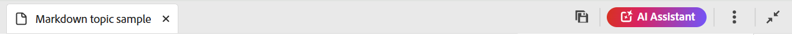

# 从编辑器中创作Markdown文档 {#id223MIE0B079}

Markdown是一种轻量级的标记语言，可帮助您将格式元素添加到纯文本文档。 Adobe Experience Manager Guides提供了从编辑器创建、创作和预览Markdown \(.md\)主题的功能。 您还可以上传现有Markdown文档并在编辑器中编辑它们。

## 创建Markdown主题

执行以下步骤，从编辑器创建Markdown主题：

1. 在“存储库”面板中，选择，然后从下拉列表中选择&#x200B;**主题**。
1. 在&#x200B;**新建主题**&#x200B;对话框中，提供以下详细信息：

   {width="300" align="left"}

   * **标题**：提供主题的标题。
   * **名称**：文件名是根据主题“标题”自动建议的。 如果管理员启用了基于UUID设置的自动文件名，则不会显示名称字段。
   * **模板**：从下拉列表中选择&#x200B;**Markdown**。 默认情况下选择模板&#x200B;**主题**。
   * **路径**：浏览要保存主题文件的路径。 默认情况下，存储库中当前选定文件夹的路径将显示在路径字段中。

   >[!NOTE]
   >
   > 如果升级，您需要将Markdown模板添加到当前使用的文件夹配置文件中。 您可以[从编辑器](./web-editor-features.md#templates)中创建新的Markdown模板，或者使用现有的Markdown模板进行创作。 有关如何在Experience Manager Guides中添加创作模板的详细信息，请查看[配置全局或文件夹级别的配置文件](../cs-install-guide/conf-folder-level.md)。
1. 选择&#x200B;**创建**。

   Markdown主题将在选定的路径中创建，并会打开以进行编辑。

   {width="650" align="left"}

>[!NOTE]
>
> 您还可以在“存储库”面板中为文件夹创建Markdown主题。 选择要创建Markdown主题的文件夹并选择&#x200B;**新建**，然后从“选项”菜单中选择&#x200B;**主题**。 现在，您可以通过在&#x200B;**创建主题**&#x200B;对话框中提供主题详细信息来创建Markdown主题。

## 了解Markdown主题的编辑器功能

本节将介绍编辑器中可用于Markdown主题创作的各种功能。 创作界面分为以下部分或区域：

* [工具栏](#toolbar)
* [内容编辑区域](#content-editing-area)
* [Source、并排模式和预览模式](#source-side-by-side-and-preview-modes)
* [右面板](#right-panel)

<!--
### Tab bar 

The tab bar features the file tabs of the topics or maps that are currently opened in the Editor along with other file-level options. 

Features available in the tab bar are explained as follows:

 {width="550" align="left"}

* **Topic tab**: Displays the currently opened topics in a tab. By default, you can view the file titles in the tab. As you hover over a file, you can view the file title and the file path as a tooltip.

    >![NOTE]
    >
    > As an administrator, you can also choose to view the list of files by filenames in the tabs. View [User preferences](./intro-home-page.md#user-preferences) for details.
* **Save all**: Saves the changes you have made in all opened topics. If you have multiple topics opened in the Editor, selecting **Save all** or pressing `Crtl+S` shortcut keys saves all documents in one click. You do not have to individually save each document.
* **AI Assistant**: [AI-powered Smart Help](./ai-based-smart-help.md) feature that helps you find relevant content from the Adobe Experience Manager Guides Documentation.
* **More actions**: Allows you to navigate to the **Assets UI**. As an administrator, you also get an option to navigate to the **Settings** page. Learn how to work with [settings](./web-editor-features.md#main-toolbar) or editor settings. 
* **Expand view**: Allows you to expand the page view using the **Expand** icon. In this view, the header bar is hidden, maximizing the content space. To return to the standard view, use the **Exit the expanded view** icon.

-->

### 工具栏

工具栏位于选项卡栏的正下方。 工具栏中可用的功能说明如下：

{align="left"}

| 特性 | 描述 |
|----------------|----------------|
| 编辑操作 | 提供对各种文档编辑功能的访问权限，包括&#x200B;**剪切**  ，**撤消**  ，**重做**  ，**副本**  ，**删除**  和&#x200B;**查找和替换**  。 您可以从&#x200B;**菜单**&#x200B;下拉菜单中访问可用选项。 |
| 文本格式设置选项 | 提供对各种文本格式选项（包括&#x200B;**标题**）的访问权限  ，**粗体**  ，**斜体**  ，**删除线**  ，**代码**  和&#x200B;**块引用**  。 |
| 内容插入选项 | 提供用于插入&#x200B;**编号列表**&#x200B;的选项  ，**排序列表**  ，**表**  ，**图像** ，**交叉引用**  和&#x200B;**符号**  放入文档。   **注意**：您还可以将图像和其他文件拖放到Markdown编辑器中。 文件将作为交叉引用链接添加，而图像则显示为标准图像元素。 |
| 版本历史记录 | 允许您创建Markdown文件的版本并查看更改历史记录。 您可以比较不同的版本，并在需要时还原为以前的版本。 版本历史记录选项存在于&#x200B;**菜单**&#x200B;下拉列表中。 |
| 另存为新版本 | 保存对主题所做的更改，并创建该主题的新版本。 如果您处理的是新创建的主题，则版本信息显示为none。 |
| 锁定/解锁 | 锁定或解锁当前文件。 锁定文件可为您提供对文件的独占写入权限。 这会限制其他用户编辑文件。 如果您希望其他人具有编辑权限，请解锁文件。 作为管理员，您还可以访问&#x200B;**强制解锁**&#x200B;功能，该功能允许您解锁被其他人锁定的文件。 |

>[!NOTE]
>
> 可以通过Markdown主题的&#x200B;**Source**&#x200B;和&#x200B;**并排显示**&#x200B;来访问&#x200B;**版本历史记录**&#x200B;功能以及在编辑操作、文本格式设置和内容插入中提到的功能。

### 内容编辑区域

内容编辑区域显示主题的Markdown源，您可以在该源中进行所有内容编辑。 在并排视图中，此区域分为两个部分 — 左侧为Markdown源视图，右侧为“预览”。 您可以同时打开多个主题，这些主题会显示在各自的选项卡中。

### Source、并排模式和预览模式

对于Markdown创作，编辑器支持三种不同的查看模式，以帮助创建内容和设置格式：

{align="left"}

* 源
* 并排
* 预览

**来源**

这是编辑器的Markdown代码视图。 您可以像在任何常规Markdown编辑器中一样编辑Markdown主题。 在Source视图中，您可以选择保存文档的修订版本、插入标题、插入表格、插入图像等。

如果您希望仅专注于编写和编辑原始Markdown而不查看渲染的输出，请使用此视图。

**并排**

此模式会将编辑器拆分为两个面板：

* 显示您正在编辑的Markdown主题的Source面板。
* 实时显示Markdown主题的渲染输出的预览面板。

{width="550" align="left"}

如果您要在编辑Markdown主题时实时查看渲染的输出，请使用此视图。

**预览**

在预览模式下打开Markdown主题会显示用户在浏览器中查看主题时主题的显示方式。 在此视图中，将从工具栏中删除所有编辑功能。 但是，您仍然可以访问工具栏中的&#x200B;**另存为新版本**、**锁定/解锁**&#x200B;功能以及右侧面板中的&#x200B;**文件属性**&#x200B;功能。

### 右面板

通过右侧面板，可以访问**文件属性面板。

“文件属性”包含以下两个部分：

**常规**

通过“一般信息”部分可以访问以下功能：

* **文件名**：显示所选主题的文件名。
* **ID**：显示所选主题的ID。
* **语言**：显示主题的语言。 在属性页面的语言字段中设置。
* **创建日期**：显示创建主题的日期和时间。
* **修改日期**：显示修改主题的日期和时间。
* **锁定者**：显示签出该主题的用户。
* **文档状态**：您可以选择并更新当前已打开主题的文档状态。 有关详细信息，请查看[文档状态](./web-editor-document-states.md)。
* **标记**：这些是主题的元数据标记。 它们是从属性页面中的标记字段设置的。 您可以键入或从下拉菜单中选择它们。 标记显示在下拉列表下方。 要删除标记，请选择标记旁边的交叉图标。
* **编辑更多属性**：您可以从文件属性页面编辑更多属性。

**引用**

利用“参照”部分，可访问以下功能：

* **用于**： Used in references列出引用或使用当前文件的文档。
* **传出链接**：传出链接列出当前文档中引用的文档。

>[!NOTE]
>
> 所有“用于中”和“出站”链接引用均使用超链接链接到文档。 您可以轻松打开和编辑链接的文档。

## 功能限制

以下Experience Manager Guides功能当前不适用于Markdown创作：

1. 审阅
2. 合并
3. AI 助手
4. 跟踪更改

**父主题：**&#x200B;[&#x200B;编辑器简介](web-editor.md)
