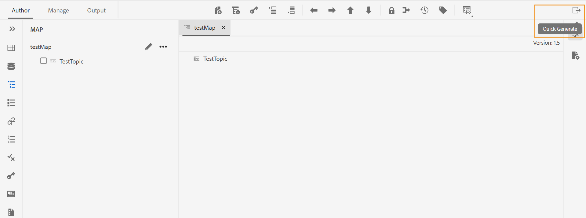

# 使用“快速生成”面板生成和查看输出 {#id22AKE050F5L}

>[!NOTE]
>
> 从版本4.0到2502开始，已弃用之前在Adobe Experience Manager Guides中提供的快速生成面板。 您不能访问“快速生成”面板来生成和查看输出

AEM Guides提供了一个集成在Web编辑器中的&#x200B;**快速生成**&#x200B;面板。 此面板允许您同时为为DITA映射创建的输出预设生成输出。 可以为一个或多个预设或为DITA映射创建的所有预设生成输出。 您还可以使用&#x200B;**快速生成**&#x200B;面板来查看为预设生成的输出。

>[!NOTE]
>
> 对于在“映射视图”面板中打开的DITA映射，将显示&#x200B;**快速生成**&#x200B;面板。

执行以下步骤以从&#x200B;**快速生成**&#x200B;面板生成输出：

1. 在“映射视图”中打开DITA映射。 “快速生成”图标出现。 它出现在&#x200B;**作者**&#x200B;和&#x200B;**管理**&#x200B;选项卡中。
1. 单击&#x200B;**快速生成**&#x200B;图标\(\)以打开&#x200B;**快速生成**&#x200B;面板。 在&#x200B;**快速生成**&#x200B;面板中，您可以看到为DITA映射创建的所有输出预设的列表。
1. 选择要为其生成输出的一个或多个预设。
1. 单击&#x200B;**生成**&#x200B;以生成所选预设的输出。 成功消息显示在输出的生成中。 如果生成失败，将显示错误消息。 您还可以查看错误日志，以了解生成过程中所发生错误的详细信息。
1. 单击特定预设的&#x200B;**查看输出** \( \)图标以查看为预设生成的输出。

**父主题：**&#x200B;[&#x200B;使用Web编辑器](web-editor.md)
