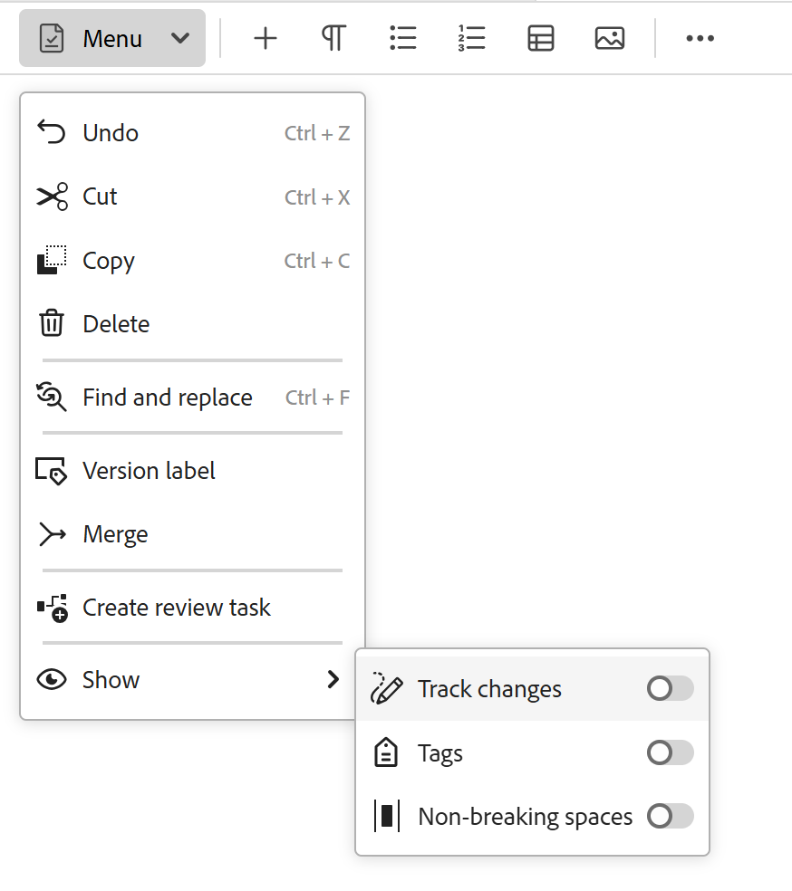
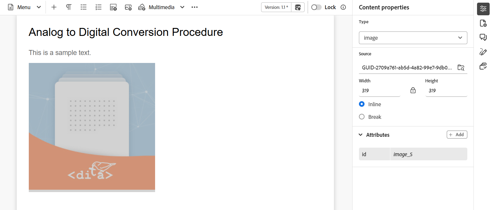
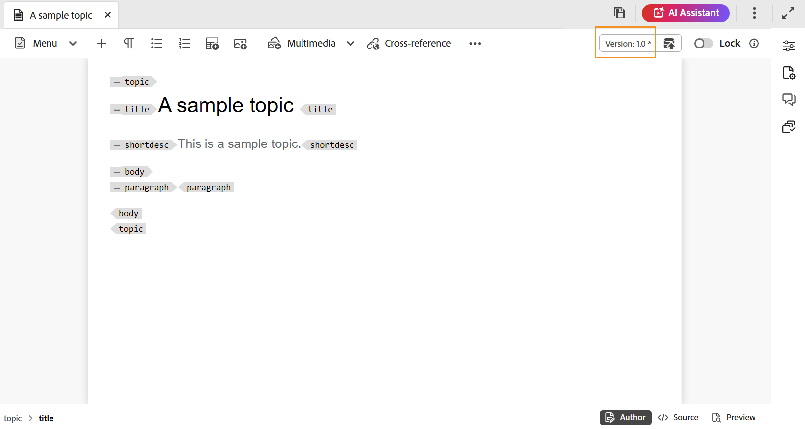

# 编辑器中的工具栏

在编辑器中打开主题或映射进行编辑时，将显示工具栏。 工具栏中可用的功能如下：

- [菜单下拉列表](#menu-dropdown)
- [内容插入选项](#content-insertion-options)
- [版本信息和另存为新版本按钮](#version-information-and-save-as-new-version)
- [锁定/解锁](#lockunlock)

>[!NOTE]
>
> 上面列出的功能仅适用于主题文件。 处理映射文件时，工具栏中会根据当前映射编辑器视图显示不同的选项。 了解[映射编辑器功能](./map-editor-advanced-map-editor.md)文档中的映射编辑器工具栏选项。

## 菜单下拉列表

“菜单”下拉菜单提供对编辑操作、“查找和替换”、“版本历史记录”、“版本标签”、“合并”、“创建审核任务”和“显示”菜单（包括“跟踪更改”、“标记”和“不间断空间”）的访问权限。

编辑器工具栏的{width="350" align="left"}

这些功能的详细说明如下：

**正在编辑操作**

在编辑器中编辑主题时，访问各种编辑操作，如&#x200B;**剪切**&#x200B;或&#x200B;***Ctrl***+***X***、**复制**&#x200B;或&#x200B;***Ctrl***+***C***、**撤消**&#x200B;或&#x200B;***Ctrl***+***Z***、**重做**&#x200B;或&#x200B;***Ctrl***+***Y***&#x200B;和菜单下拉列表中存在&#x200B;**删除**。

**查找和替换**

**查找和替换**&#x200B;功能在创作和Source视图模式下可用。 启用后，“查找并替换”文本栏将显示在主题编辑区域的底部。 您可以使用快捷键&#x200B;**CTRL**+**F**&#x200B;调用查找和替换栏。

{align="left"}

使用设置图标\(\)，您可以切换&#x200B;**忽略大小写**&#x200B;和&#x200B;**仅限全字**&#x200B;搜索选项。 要执行不区分大小写的搜索，请打开\（或选择\）**忽略大小写**&#x200B;选项。 否则，如果要执行区分大小写的搜索，请关闭\（或取消选择\）**忽略大小写**&#x200B;选项。 您还可以选择搜索整个词。

搜索是即时的，这意味着当您在&#x200B;**查找**&#x200B;字段中键入搜索短语或单词时，将立即在主题中搜索和选择搜索词。 同样，要替换主题中的文本，请在相应的字段中输入搜索词及其替换词，然后选择&#x200B;**替换**&#x200B;或&#x200B;**全部替换**&#x200B;按钮。

在Source视图中，**查找和替换**&#x200B;功能对于搜索特定元素或属性非常有用。 例如，如果要替换`@product`属性的值，可以轻松地从Source视图中完成此操作。 “作者”视图不允许您根据属性或元素进行搜索。 但是，在使用&#x200B;**全部替换**&#x200B;功能时必须小心，因为它可能会覆盖XML代码。

**版本历史记录**

编辑器中的&#x200B;**版本历史记录**&#x200B;功能允许您检查DITA文件的可用版本、比较这些版本以及从编辑器本身还原到任何版本。 您可以将当前版本（也可以是工作副本）的内容和元数据与同一文件的任何先前版本进行比较。 您还可以查看比较版本的标签和注释。

>[!NOTE]
>
> 仅当对主题或映射的第一个版本进行了更改时，才会显示版本历史记录选项。

    
 访问版本历史记录的步骤 

1. 在编辑器中打开主题。
1. 从&#x200B;**菜单**&#x200B;下拉列表中选择&#x200B;**版本历史记录**。

   出现&#x200B;**版本历史记录**&#x200B;对话框。

   {width="550" align="left"}

   *预览不同版本主题中的更改。*

1. 在&#x200B;**比较对象**&#x200B;下拉列表中选择要比较或还原的主题版本。

   >[!NOTE]
   >
   > 如果某个版本应用了标签，则这些标签也会与版本号一起显示\（在括号中）。

1. 启用&#x200B;**查看标签和注释**&#x200B;选项以查看应用于当前版本和比较版本的标签和注释。
1. 您还可以在&#x200B;**版本历史记录**&#x200B;对话框中查看以下信息：

   **预览**&#x200B;选项卡：新添加的内容为绿色字体，已删除的内容为红色字体。

   **元数据**&#x200B;选项卡：新添加的元数据为绿色字体，已删除的元数据为红色字体。

   {width="550" align="left"}的元数据差异

   *在版本历史记录中比较不同版本的元数据。*

   >[!NOTE]
   >
   > 系统管理员可以从&#x200B;**设置**&#x200B;中的“元数据”选项卡更改要显示的元数据。 有关详细信息，请参阅&#x200B;**选项卡栏**&#x200B;的[更多操作](./web-editor-tab-bar.md)部分。

   您还可以查看当前版本和比较版本的用户和时间详细信息。

   从下拉列表中选择版本后，**还原到所选版本**&#x200B;选项即可用。 预览窗口显示当前版本与所选版本的主题之间的差异。

1. 选择&#x200B;**还原到所选版本**，将工作副本还原为主题的所选版本。

   将显示“还原版本”对话框。

   {width="550" align="left"}

1. \（*可选*\）提供还原为早期版本的原因。 您也可以创建主题当前活动工作副本的新版本。

1. 选择&#x200B;**确认**。

   文件的工作副本将还原为所选版本。 如果选择创建当前活动工作副本的新版本，则也会创建包含所有工作更改的新版本的文件。

   在还原到早期版本时，将显示一个可视提示，指示您当前使用的版本不是最新版本。

   {align="left"}

**版本标签**

标签可帮助您确定特定主题在DDLC \（文档开发生命周期\）中的阶段。 例如，在处理主题时，可以将标签设置为“已批准”。 发布主题并提供给客户后，您可以为该主题分配“已发布”标签。

Experience Manager Guides允许您以自由格式文本格式指定标签或使用一组预定义标签。 自定义标签将允许系统中的任何作者根据其选择指定标签。 这提供了灵活性；但是，它会在系统中引入不一致的标签。 要解决此问题，管理员可以配置一组预定义标签。 有关配置预定义标签的详细信息，请在“安装和配置Adobe Experience Manager Guides as a Cloud Service”中查看&#x200B;*配置和自定义XML Web编辑器*。

这些标签会以下拉列表形式显示给需要指定标签的作者。 这可确保在系统中仅使用预定义、一致的标签。

您可以通过多种方法向主题应用标签 — Assets UI中的[版本历史记录](web-editor-use-label.md)面板、[基线](/help/product-guide/user-guide/generate-output-use-baseline-for-publishing.md) UI和编辑器。 编辑器中的版本标签功能为作者提供了一种快速、轻松的方法为其主题分配标签。

    
 从编辑器向主题添加标签的步骤 

1. 在编辑器中打开主题。

1. 从“菜单”下拉列表中选择&#x200B;**版本标签**。

   此时将显示“版本标签管理”对话框。

   {width="350" align="left"}

   “版本标签管理”对话框分为两部分 — 左侧面板包含可用于主题的版本列表以及标签下拉列表\（或用于输入标签的文本框），右侧面板包含主题的预览。

1. 选择要应用标签的版本。

   从版本列表中选择其他版本的主题时，“预览”面板将显示当前版本与所选版本之间的更改

   >[!NOTE]
   >
   > 如果标签已应用于某个版本，则它将显示在下拉列表中的版本号旁边，以及“选择版本”列表的下方。 您可以通过选择标签旁边的\(**x**\)图标来移除现有标签。

1. 如果您的管理员定义了标签列表，则会显示一个标签下拉列表，您可以从中选择要应用的标签。 您可以从下拉列表中选择多个标签。

   否则，您会看到一个文本框，您可以在其中输入要添加到主题中的标签。

   >[!NOTE]
   >
   > 不能对主题的多个版本应用相同的标签。 如果尝试关联现有标签，则可以选择将其从现有版本中删除，并将其应用到主题的所选版本。

1. 选择&#x200B;**添加标签**。

1. 在“应用标签”确认消息中，选择&#x200B;**移动标签（如果用于其他版本）**&#x200B;选项，以将标签从现有版本移动到所选版本。 如果不选择此选项，并且有标签被分配给主题的不同版本，则它们不会移动到所选主题的版本。 在标签申请过程中会忽略此类标签。

**合并**

在多作者环境中工作时，很难跟踪其他作者在主题或地图中所做的更改。 “合并”功能不仅让您能够更好地控制变更的查看，而且还可以控制哪些变更保留在文档的最新版本中。

    
 合并主题文件 

要合并主题中的更改，请执行以下步骤：

1. 在编辑器中打开主题。

1. 选择&#x200B;**合并**。

   此时将显示“合并”对话框。

   {width="550" align="left"}

1. *\（可选\）*&#x200B;您还可以浏览并从存储库中的其他位置选择新文件。

1. 选择要与文件的当前版本进行比较的文件版本。

1. 从“选项”中选择：

   - **跟踪选定版本中的更改**：此选项以跟踪的更改形式显示所有内容更新。 然后，您可以选择一次接受或拒绝文档中的更改，或者一次接受或拒绝全部更改。

   - **还原到所选版本**：此选项将文档的当前版本还原到所选版本。 此选项不会向您提供对接受或拒绝哪些内容的任何控制。

1. 选择&#x200B;**完成**。

1. 如果您选择了&#x200B;**跟踪来自所选版本**&#x200B;的更改选项，则来自所选版本的所有更改将显示在右侧面板的跟踪更改功能中。

   您可以从“跟踪的更改”面板中选择接受或拒绝所有注释，或者接受或拒绝单个注释。

    
 合并映射文件 

要合并映射文件中的更改，请执行以下步骤：

1. 在编辑器中打开映射。

1. 选择&#x200B;**合并**。

   将出现“合并”对话框。

   {width="550" align="left"}

1. *\（可选\）*&#x200B;您还可以浏览并从存储库中的其他位置选择新文件。

1. 选择要与文件的当前版本进行比较的文件版本。

1. 从“选项”中选择：

   - **跟踪选定版本中的更改**：此选项以跟踪更改的形式显示所有内容更新。 然后，您可以选择一次接受或拒绝文档中的更改，或者一次接受或拒绝全部更改。

   - **还原到所选版本**：此选项将文档的当前版本还原到所选版本。 此选项不会向您提供对接受或拒绝哪些内容的任何控制。

1. 选择&#x200B;**完成**。

1. 如果您选择了&#x200B;**跟踪选定版本**&#x200B;中的更改选项，则选定版本中的所有更改将显示在“跟踪的更改”面板\（位于右侧\）中。

   您可以从“跟踪的更改”面板中选择接受或拒绝所有更改，或者接受或拒绝映射文件中的单个更改。

**创建审核任务**

您可以直接从编辑器[创建当前主题的审阅任务](./review-send-topics-for-review.md)或映射文件。 打开要为其创建审阅任务的文件，然后从“菜单”下拉列表中选择&#x200B;**创建审阅任务**&#x200B;以启动审阅创建流程。

**显示菜单**

“显示”菜单包含以下功能：

- **跟踪更改：**您可以启用“跟踪更改”模式，以跟踪对文档所做的所有更新。 启用跟踪更改后，文档将捕获所有插入和删除。 使用删除线突出显示所有已删除的内容，并以绿色文本突出显示所有插入。 此外，您还可以在主题页面的边缘获得更改条。 再次重申，对于已删除的内容，将显示红色栏，对于添加的内容，将显示绿色栏。 如果在同一行上进行了添加和删除，则会同时显示绿色栏和红色栏。
以下屏幕截图突出显示删除和插入的内容以及更改条：
  {width="650" align="left"}

  跟踪文档中的更改的典型用例可以是进行同行审阅。 您可以启用跟踪更改并共享文档以供审阅，然后审阅者进行更改并启用跟踪更改。 当您收到文档时，您应该具有查看建议更新的机制，以及一种接受或拒绝更改的便捷方式。

  Experience Manager Guides提供了跟踪的更改功能，该功能包含在文档中进行的更新的相关信息。 “跟踪的更改”功能提供有关已进行哪些更新、谁进行了这些更新以及何时进行这些更新的信息。 使用跟踪的更改功能，您还可以轻松地接受或拒绝文档中的建议更新。

  要访问该功能，请选择右侧面板中的&#x200B;**跟踪更改**&#x200B;图标。

  {width="300" align="left"}

  选择跟踪的更改将选择文档中的已更改内容。 您可以通过选择“接受更改”图标来接受更改，或通过选择“拒绝更改”来拒绝更改。

  如果要通过单击接受或拒绝所有更改，请选择&#x200B;**接受所有更改**&#x200B;或&#x200B;**拒绝所有更改**。

  >[!NOTE]
  >
  > “预览”模式允许您查看文档，无论是否包含已更改内容的标记。 有关详细信息，请查看[预览](web-editor-views.md#preview-mode)模式。

- **标记：**&#x200B;编辑器中的&#x200B;**标记**&#x200B;功能是一个可控制DITA元素可见性的切换按钮。 启用后，它会在内容中显示结构标记，使您能够更有效地查看和管理底层DITA元素。 禁用后，编辑器将隐藏这些标记，从而提供更干净且更集中的创作环境。

  以下屏幕截图显示了已启用“标记”视图的文档：

  {width="650" align="left"}

  下列操作可以在带有Tags的文档中执行：

   - **选择元素**：选择元素的开始或结束标记以选择其内容。

   - **展开或折叠标记**：选择标记中的+或 — 符号以展开或折叠标记。

   - **使用上下文菜单**：上下文菜单提供剪切、复制或粘贴选定元素的选项。 您还可以在所选元素之前或之后插入元素。 其他选项允许您生成ID或打开选定元素的“属性”面板。

   - **拖放元素**：选择元素的标记并将其轻松拖放到文档上。 如果放置位置是允许元素的有效位置，则元素将放置在放置的位置。

  >[!NOTE]
  >
  > 如果用户从编辑器中启用“标记”视图，则即使跨会话，该视图也会保持启用状态。 这意味着您无需再次启用“标记”视图即可稍后访问它。 新用户会话的“标记”视图的默认值由`tagsView`文件中的`ui\_config.json`属性决定。 有关更多详细信息，请参阅安装和配置Adobe Experience Manager Guides as a Cloud Service中的[为标记视图配置默认值](../cs-install-guide/configure-default-value-tags-view.md)部分。

- **不间断空格：**&#x200B;启用此选项，以在编辑器中编辑不间断空格时显示指示符。 它仅在DITA主题和DITA映射的&#x200B;**作者**&#x200B;视图中可见。

## 内容插入选项

**元素** - 

在当前或下一个有效位置插入有效元素。 也可以使用键盘快捷键&#x200B;***Alt***+***Enter***&#x200B;打开“元素”对话框。 例如，您正在编辑一个段落，然后在&#x200B;**元素**&#x200B;对话框中，将显示可插入段落中的元素列表。 选择要插入的元素。 您可以使用键盘滚动元素列表，然后按&#x200B;***Enter***&#x200B;插入所需的元素。

您可以查看两种类型的有效元素：

- **当前位置上的有效元素**：此列表显示可在当前光标位置本身插入的元素。

- **当前位置之外的有效元素**：列表显示可在元素层次结构中当前元素的任何父元素之后插入的元素。

例如，如果您在内联`<b>`元素中，则可以在当前位置插入诸如`<u>`、`<xref>`、`<i>`之类的元素。 相反，您可以在当前位置之外插入诸如`<table>`和`<topic>`之类的元素。

您还可以在搜索框中键入字符或字符串，并搜索以它开头的元素。

{width="300" align="left"}

*输入&#39;t&#39;以搜索所有以&#39;t&#39;开头的有效元素。*

如果您在块元素（如`note`）中工作，则使用插入元素图标在`note`元素之后插入新元素。 在以下屏幕快照中，注释元素已插入p \(paragraph\)元素中：

{align="left"}

如果在注释元素中按Enter键，则会在注释元素本身中创建一个新段落。 要在注释外部插入新元素，请在元素痕迹导航中选择p元素\（在屏幕快照中高亮显示\），然后选择“元素”图标或按&#x200B;***Alt***+***Enter***&#x200B;以打开“插入元素”对话框。 然后，选择所需的元素并按Enter键将所选元素插入到注释元素之后。

当出现闪烁的块光标时，您还可以在两个元素之间添加元素。

{width="300" align="left"}

例如，如果您正在处理DITA主题，并且块光标在简短描述和正文之间闪烁，则可以添加`prolog`元素，然后添加版权、作者和其他详细信息。

输入新元素的另一种方法是使用上下文菜单。 在文档中的任意位置单击鼠标右键以调用上下文菜单。 从该菜单中选择&#x200B;**插入元素**&#x200B;以显示&#x200B;**插入元素**&#x200B;对话框，然后选择要插入的元素。

{width="300" align="left"}

**段落** - 

在当前或下一个有效位置插入段落元素。

**项目符号列表** - 

在当前或下一个有效位置创建项目符号列表。 如果您位于项目符号列表上并选择此图标，该项目将转换为普通段落。

**编号列表** - 

在当前或下一个有效位置创建编号列表。 如果您在编号列表中并选择此图标，该项目将转换为普通段落。

>[!NOTE]
>
>您还可以从列表项的上下文菜单中选择&#x200B;**拆分列表**&#x200B;选项以拆分当前列表并在同一级别开始一个新列表。

**表** - 

在当前或下一个有效位置插入表。 选择“表”图标以打开“插入简单表”对话框。

{width="550" align="left"}

>[!NOTE]
>
> 您还可以从MS Word或Excel复制表并将其粘贴到Experience Manager Guides主题文件中。 复制的表将粘贴为`<simpletable>`或`<tgroup>`，具体取决于XML编辑器配置中配置的设置。 有关详细信息，请查看[配置粘贴表的显示](../cs-install-guide/conf-pasted-tables.md)。

您可以指定表中所需的行数和列数。 如果要将第一行保留为表标题，请选择&#x200B;**将第一行设置为标题**&#x200B;选项。 要向表格添加标题，请在标题字段中输入该标题。

插入表后，可以使用上下文菜单修改表。

{width="550" align="left"}

使用该表的上下文菜单，您可以：

- 插入单元格、行或列

- 在右侧和向下合并单元格

- 水平或垂直拆分单元格

- 删除单元格、行或列

- 生成Id

    
 定义表格中多个单元格、整行或列的属性 

您还可以在表的多个单元格、整行或列上定义属性。 例如，要对齐表格单元格，请拖动并选择所需的单元格。 在右侧的“内容属性”面板中，属性&#x200B;**Type**&#x200B;更改为&#x200B;**entry**。

1. 在&#x200B;**属性**&#x200B;部分中，选择&#x200B;**+添加**。
1. 从`@valign`属性&#x200B;**下拉列表中选择**&#x200B;属性。
1. 从值下拉列表中，选择要应用于选定表单元格的所需文本对齐方式。
1. 选择&#x200B;**添加。**

{align="left"}

**图像** - 

在当前或下一个有效位置插入图像。 选择“图像”图标以打开“插入图像”对话框，然后搜索并选择要插入的图像。

>[!NOTE]
>
> 您也可以通过将图像从本地系统拖放到文章上来添加图像。 在本例中，使用&#x200B;**上传Assets**&#x200B;工作流添加图像文件。  有关更多详细信息，请在&#x200B;**左侧面板**&#x200B;部分中查看[上传Assets](./web-editor-left-panel.md)工作流。

{width="300" align="left"}

在&#x200B;**选择文件**&#x200B;对话框中，您可以从&#x200B;**存储库**&#x200B;或&#x200B;**收藏集**&#x200B;中浏览所需的图像文件。

>[!NOTE]
>
> 文件和文件夹路径浏览器在Experience Manager Guides as a Cloud Service 2601版中经过修订的UI中引入。 默认情况下，将启用新接口。 如果您希望在不进行这些更新的情况下继续使用现有UI，请联系您的客户成功团队以禁用此新增强功能。

使用顶部的痕迹导航和左侧的文件夹导航面板可轻松导航浏览文件夹。

您可以按文件名、文件标题和内容搜索所需的图像文件。 您还可以按路径\（搜索范围\）、文档状态、锁定者、上次修改时间和标记筛选搜索结果。 文件类型筛选器已预先应用于&#x200B;**图像**，并且对于其他文件类型保持禁用状态，以允许有效的文件选择。 有关在此路径浏览器上使用筛选器的更多详细信息，请在编辑器中查看[其他功能](./web-editor-other-features.md)。

找到所需的图像文件后，选择该文件并选择&#x200B;**选择**&#x200B;将图像插入到文档中。 您可以插入各种格式的图像文件，如`.png`、`.svg`、`.gif`、`.jpg`、`.eps`、`.ai`、`.psd`等。

也可以在“插入图像”对话框中为图像添加图像/图形标题和替换文本。

>[!NOTE]
>
> 插入图像并为该图像指定替换文本时，会按照最新的DITA标准将其添加到`<alt>`元素中。 不建议将`@alt`属性用于替换文本，但在以前的DITA版本中仍支持此属性。

插入图像后，您可以从“内容属性”面板中更改高度、宽度、版面和属性。 选择图像文件，然后在右侧面板的“内容属性”面板中进行更改。

{align="left"}

Source字段显示所插入图像文件的UUID。 通过将鼠标指针悬停在Source字段上，可以找到所插入图像文件的完整路径。 该路径将显示在工具提示中。

您可以通过提供图像文件的“高度”或“宽度”值来调整图像的大小。 图像的纵横比会自动得到保持。 如果需要，还可以选择不保持图像文件的长宽比，方法是选择\(属于“保持长宽比”(Maintain Aspect Ratio)的\)锁图标并提供“高度”(Height)和“宽度”(Width)值。

也可以将图像的“放置”设置指定为“内联”或“破断”。 如果选择使用“断点”放置选项，则可以选择对齐图像的位置（“左”、“中”或“右”）。

您还可以通过在&#x200B;**属性**&#x200B;字段中选择所需的属性来为图像文件添加其他属性。

>[!NOTE]
>
>您还可以在图像中定义可单击区域\（图像映射\）。 有关更多详细信息，请在&#x200B;**左侧面板**&#x200B;部分中查看[插入/编辑图像映射](web-editor-left-panel.md)功能说明。

图像或媒体文件的&#x200B;**上下文菜单**

也可以使用上下文菜单对图像和媒体文件执行一些常见操作。 在图像上的任意位置单击鼠标右键以调用上下文菜单。

上下文菜单提供剪切、复制或粘贴图像或媒体的选项。 可在所选元素之前或之后插入元素。 您还可以选择重命名或取消元素包装。 您可以在存储库中找到选定的图像或媒体，或在Assets UI中查看文件预览。

上下文菜单中的其他选项允许您复制路径、编辑图像映射、重命名元素、创建代码片段或为所选元素生成ID。

**插入/编辑图像映射**

在选定图像上插入图像映射。 具有链接到主题或网页的可单击区域的图像称为图像映射。

在当前主题中选择图像，然后选择插入/编辑图像映射图标，以打开插入图像映射对话框。

{width="650" align="left"}

选择首选形状矩形、圆形或多边形以定义要用作链接的图像的区域。 定义区域后，将出现“引用”对话框，您需要在其中指定指向内部或外部内容的链接：

{width="350" align="left"}

如果区域重叠，可以通过单击工具栏中相应的图标来将形状前移或后移。 您也可以通过选择某个区域并单击删除图标来删除该区域。 双击某个区域会打开“参照”对话框，您可以在其中更改目标链接。 在图像上标记所需的区域后，选择&#x200B;**完成**&#x200B;以保存更改。

**多媒体**

插入不同类型的多媒体文件。 选择“多媒体”下拉图标，然后选择要插入的文件类型。 支持的多媒体格式包括：

- 音频文件
- 视频文件
- YouTube
- Vimeo

选择“音频或视频文件”选项时，您会看到&#x200B;**选择文件**&#x200B;对话框来浏览并从存储库或收藏集中选择所需的文件。

{width="650" align="left"}

如果选择YouTube或Vimeo，则会显示&#x200B;**插入多媒体**&#x200B;对话框。 将视频文件的链接粘贴到Web链接字段中，然后选择插入以在文档中的当前或下一个有效位置添加视频。

{width="350" align="left"}

>[!NOTE]
>
> 添加YouTube视频链接时，您需要在URL中将字符串`watch?v=`替换为`embed`。 例如，要添加YouTube视频链接： `https://www.youtube.com/**watch?v**=WlIKQOrmZcs`，您需要将其添加为： `https://www.youtube.com/**embed/**WlIKQOrmZcs`。 此更改可确保在AEM Site和PDF输出中嵌入视频。

您还可以从&#x200B;**插入多媒体**&#x200B;对话框添加音频或视频文件。 选择“音频/视频文件”选项，然后选择浏览图标以启动存储库视图。 从存储库中选择音频或视频文件，然后选择&#x200B;**选择**&#x200B;以在“音频/视频文件”字段中添加该文件的链接。 如果选择视频文件，则文件的预览也会显示在“预览”区域中。 您可以播放视频文件以查看其预览。

{width="650" align="left"}

**交叉引用**

插入以下类型的引用：内容引用、内容键引用、键引用、文件引用、Web链接或电子邮件链接。

选择&#x200B;**选择文件**&#x200B;图标\（用于内容引用和文件引用\）或&#x200B;**选择根映射**&#x200B;图标\（用于内容键引用和键引用\），然后选择要链接到的所需文件或内容。

{width="650" align="left"}

所选引用的链接即添加到文档中。 链接上的上下文菜单为您提供了以下选项：

- **插入元素**：显示可在给定上下文中插入的有效元素列表。
- **复制UUID**：复制插入引用的UUID。
- **复制路径**：复制插入引用的完整路径。
- **生成ID**：为插入的引用生成唯一ID。

您也可以使用要引用的文件的UUID进行搜索。 对于“内容”和“键引用”链接，输入要链接到的文件的UUID，将自动搜索该文件并在“预览”部分中显示该文件。 指定文件的UUID时，无需明确提及.xml文件的文件扩展名。 .xml扩展名会自动附加到UUID中。

{width="650" align="left"}

如果您的管理员在&#x200B;*XMLEditorConfig*&#x200B;中启用了UUID选项，则您将在&#x200B;**Link**&#x200B;属性中查看引用内容的UUID。

>[!IMPORTANT]
>
> 根据标准DITA行为，scope=`external`属性不能应用于内部链接，因为它仅用于引用外部资源。 将此属性应用于内部链接可能会中断工作流。 对于Experience Manager Guides中管理的内容，请改用默认范围=`local`或基于键的引用。

{align="left"}

>[!NOTE]
>
> 如果未启用&#x200B;**启用UUID**&#x200B;选项，则会显示引用内容的相对路径。

>[!IMPORTANT]
>
> 即使引用内容的相对路径显示在&#x200B;**Link**&#x200B;属性中，链接仍使用引用内容的UUID在内部创建。

>[!TIP]
>
> 查看最佳实践指南中的引用部分，了解有关引用内容的最佳实践。

**在存储库视图中筛选搜索**

在&#x200B;**选择文件**&#x200B;对话框中，您可以搜索位于&#x200B;**存储库**&#x200B;的选定路径上的文件中的某些文本。 例如，*braking*&#x200B;将在下面的屏幕快照中进行搜索。

>[!NOTE]
>
> 文件和路径浏览器在Experience Manager Guides as a Cloud Service 2601年版本中通过修订后的UI引入。 默认情况下，将启用新接口。 如果您希望在不进行这些更新的情况下继续使用现有UI，请联系您的客户成功团队以禁用此新增强功能。

{width="650" align="left"}

您可以使用顶部的痕迹导航和左侧的文件夹导航面板轻松地在文件夹中导航。

您可以按“文件名”、“文件标题”和“内容”搜索所需的文件。 您还可以使用右侧面板中的增强型过滤器来缩小搜索范围。 有关更多详细信息，请查看编辑器中的[其他功能](./web-editor-other-features.md)。

将显示包含搜索文本的已过滤文件的列表。 您还可以预览文件的内容。

>[!NOTE]
>
> 系统管理员还可以配置文本过滤器，并显示或隐藏其他过滤器。 有关更多详细信息，请参阅安装和配置Adobe Experience Manager Guides as a Cloud Service中的&#x200B;*配置文本过滤器*&#x200B;部分。

**可重复使用的内容** - 

重复使用项目中任何其他文档中存在的内容。 您可以插入内容，方法是直接链接到文件中的内容，或者使用键引用，查看[解析键引用](map-editor-other-features.md#id176GD01H05Z)。 当选择可重用内容图标时，您将看到重用内容对话框：

{width="650" align="left"}

在“重用内容”对话框中，为文件引用选择DITA文件，或选择包含键引用的DITA映射文件。 选中后，该主题或关键引用将显示在对话框中。 您可以选择要插入的主题的ID/键，然后选择&#x200B;**完成**&#x200B;以在主题中插入内容。

对于插入“内容引用”，您还可以输入文件的UUID，并且该文件中的可重用内容将在“预览”部分中列出。

根据插入链接的设置，您可以在“属性”面板或Source代码视图中查看插入内容的UUID或相对路径。 链接始终使用引用内容的UUID创建。 在“安装和配置Adobe Experience Manager Guides as a Cloud Service”中查看&#x200B;*配置基于UUID的链接*。

>[!NOTE]
>
> 若要在引用的内容之前或之后添加内容，请使用&#x200B;*Alt*+*Left*&#x200B;箭头键或Alt+*Right*&#x200B;箭头键将光标移动到所需位置。

您还可以将引用的内容嵌入主题中，方法是右键单击引用的内容，然后从上下文菜单中选择&#x200B;**将引用替换为内容**。

**符号** - 

在主题中插入特殊字符。 选择“符号”图标以打开“插入特殊字符”对话框。

>[!NOTE]
>
> Experience Manager Guides提供了可移动和可调整大小的对话框。 可以在右下角调整具有两条交叉线的对话框的大小。 “特殊字符”对话框中的交叉线如下所示。

{width="350" align="left"}

在“插入特殊字符”对话框中，可以使用特殊字符的名称搜索特殊字符。 所有特殊字符都存储在各种类别下。 使用选择类别下拉列表并选择类别。 将显示所选类别中可用的特殊字符。 您可以使用箭头键浏览特殊字符列表，或选择要插入的所需字符。 所选特殊字符的“名称”和“十六进制代码”显示在列表下方。 选择&#x200B;**插入**&#x200B;以在文档中插入选定的字符。

**关键字** - 

插入在DITA映射中定义的关键字。 选择“关键字”选项以打开“键参照”对话框。

{width="550" align="left"}

关键字按字母顺序列出，您还可以通过在“搜索”框中键入搜索字符串来搜索关键字。 搜索结果将返回包含ID或值中的字符串的关键字。 此对话框中列出了在DITA映射中定义的关键字。 选择要插入的关键字并选择&#x200B;**插入**。

也可以通过右键单击该关键字并选择“属性”选项来更改插入关键字的属性。 打开&#x200B;**关键字**&#x200B;的属性对话框：

{width="550" align="left"}

您可以更改关键字的属性或向关键字添加新属性。

**代码片段** - 

在当前或下一个有效位置插入代码片段。 要使此功能正常工作，您必须在系统中定义代码片段。 有关添加代码片段的更多信息，请在&#x200B;**左侧面板**&#x200B;部分中查看[代码片段](./web-editor-left-panel.md)功能说明。

选择“代码片段”选项时，您会看到插入代码片段目录。 目录是上下文相关的，这表示只有在当前位置允许显示代码片段时，才会显示代码片段。

以下示例显示了两个预先配置的代码片段 — Warning和Error ，它们可以插入文档中的当前位置。

{width="300" align="left"}

当从列表中选择一个代码片段时，它会插入到文档中的当前或下一个有效位置。 以下屏幕截图显示了文档中插入的错误片段：

{width="400" align="left"}

**引用次数** - 

创建引文并将它们添加到您的内容中。 了解如何[添加和管理内容中的引文](./web-editor-apply-citations.md)。

**查询数据** - 

与数据源连接并使用数据创建内容。 了解如何[使用数据源中的数据](./web-editor-content-snippet.md)。

## 版本信息并另存为新版本

**版本信息和另存为新版本**&#x200B;功能将版本跟踪和内容保存合并为单个功能。

- 版本信息显示主题或映射的当前版本。 版本号旁边会显示一个星号(*)，表示未保存的更改。

  版本号会随为主题或映射文件创建的每个新版本而更改。 如果您正在处理新创建的文档，则版本信息显示为&#x200B;**none**。

  {align="left"}

- **另存为新版本**&#x200B;是一个按钮，用于保存您在主题中所做的更改，并创建主题的新版本。

  {align="left"}

当您选择使用&#x200B;**另存为新版本**&#x200B;保存主题或映射时，将出现以下对话框：

{width="300" align="left"}

输入注释和版本标签以标识更改，并选择&#x200B;**保存**&#x200B;以创建文件的新版本。

当您选择&#x200B;**另存为新版本**&#x200B;选项时，该主题的第一版本将在DAM中创建，该版本也将成为您主题的当前活动版本。 之后，如果您还原到该主题的旧版本，则该版本将成为您当前的主题活动版本。

如果您的管理员具有预配置的版本标签，则您将在下拉列表中查看这些标签。 您可以从可用标签列表中选择标签并保存文档。

{width="300" align="left"}

在保存主题时，可以添加注释，以指定在主题中所做的更改。 此注释显示在主题的“版本历史记录”中。

如果您的主题正在审核中，您的审核者将收到通知，告知有较新版本的主题可用。 他们可以轻松访问文档的最新修订版，并继续查看您主题的最新版本。

将指针悬停在主题标题上时，会显示文件标题、文件路径和版本号。

{align="left"}

>[!NOTE]
>
> 在主题某个版本可用后，您还可以向主题添加标签。 然后，可以使用这些标签创建用于发布文档特定版本的基线。 有关在主题中使用标签的详细信息，请查看[使用标签](web-editor-use-label.md#)。

## 锁定/解锁

锁定或解锁当前文件。 锁定文件可为您提供对文件的独占写入权限。 这会限制其他用户编辑文件。 如果您希望其他人具有编辑权限，请解锁文件。 当文件被解锁时，更改将保存在文件的当前版本中。

{align="left"}

如果您在“映射视图”中并展开父映射，则只需单击一下即可锁定映射中的所有文件。 只需展开父映射文件并选择父文件即可，这将导致选择映射中的所有文件。 然后，您可以选择&#x200B;**锁定** 以获取映射中所有文件的锁定。

在“存储库”面板中，锁定的文件会显示锁定的图标。 当您将鼠标悬停在此锁定图标上时，“由您锁定”/“用户名”将显示为工具提示。

{width="350" align="left"}

如果某个文件被其他用户锁定，将鼠标悬停在存储库中的锁定图标上会显示锁定该文件的用户的名称。 在这种情况下，文件将以只读模式打开，版本信息旁边显示&#x200B;**只读访问权限**。

作为管理员，您还可以访问&#x200B;**强制解锁**&#x200B;功能，该功能允许您解锁其他用户锁定的文件。 使用此功能可以访问其他用户锁定的文件的编辑权限。

{width="350" align="left"}
**父主题：**[&#x200B;编辑器简介](web-editor.md)
