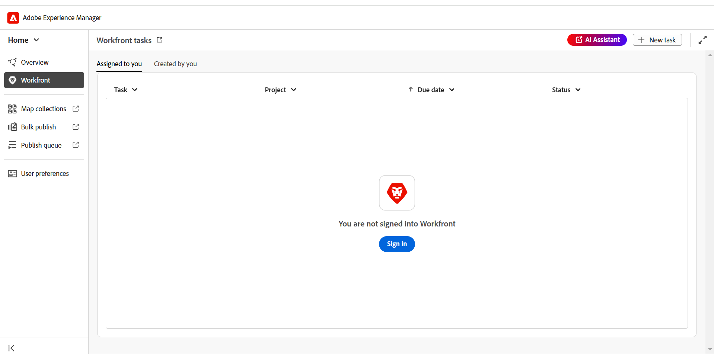
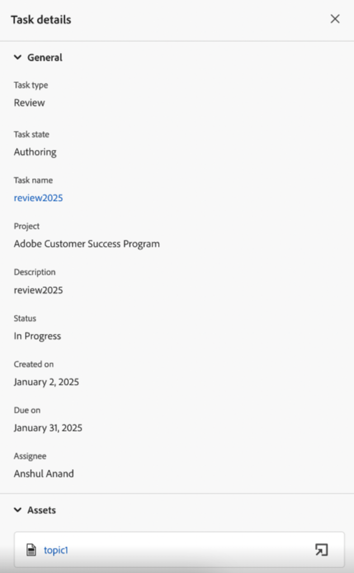
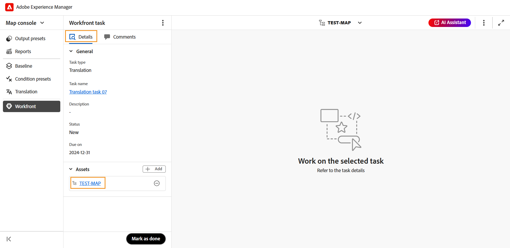

# Workfront集成

Adobe Workfront是一个基于云的工作管理解决方案，可帮助团队和组织高效地规划、跟踪和管理其工作。 Experience Manager Guides与Adobe Workfront之间的集成让您能够在Experience Manager Guides核心CCMS功能之上访问强大的项目管理功能，从而允许您高效地计划、分配和跟踪任务。

利用此集成，您可以直接从Experience Manager Guides创建和管理Adobe Workfront任务。 例如，作为作者，您可以直接在Experience Manager Guides界面中创建审阅任务（添加了一个或多个DITA主题或映射），并将其分配给审阅者。 作为审阅人，您可以在Experience Manager Guides审阅UI中处理分配的任务，并将它们返回给具有注释的作者。 同样，您可以创建一个发布和翻译任务，然后将其分配给需要对其进行处理的用户。

该集成还允许您监视工作队列，确保您保持有条不紊并控制所有任务（已分配的任务）。

**主要功能**

通过Experience Manager Guides和Adobe Workfront集成，您可以：

* 计划、分配和跟踪单个任务和项目的进度，而无需依赖多个非集成工具。
* 更有效地管理所有Experience Manager Guides工作流程，包括创作、审阅、发布和翻译内容。
* 每当分配新任务时，接收来自Adobe Workfront的电子邮件通知。 有关详细信息，请查看[通知概述](https://experienceleague.adobe.com/zh-hans/docs/workfront/using/basics/use-notifications/wf-notifications)。
* 使用Adobe Workfront的直观仪表板监控项目运行状况，从而实时了解项目绩效。

  要了解为Experience Manager Guides中的项目经理启用的Adobe Workfront强大的项目管理功能，请查看[计划项目概述](https://experienceleague.adobe.com/zh-hans/docs/workfront/using/manage-work/projects/plan-a-project/plan-project)。

## 开始使用

管理员配置并启用Adobe Workfront后，可以直接从[Experience Manager Guides主页](./intro-home-page.md)访问任务。

执行以下步骤以访问您的Adobe Workfront任务：

1. 登录Experience Manager Guides并打开&#x200B;**主页**。
2. 在左侧面板中，选择&#x200B;**Workfront**。

   显示&#x200B;**Workfront tasks**&#x200B;页面。

   {align="left"}
3. 选择&#x200B;**登录**。

   系统会将您重定向至Adobe Workfront登录页面。
4. 使用Experience Manager Guides中使用的相同电子邮件地址登录，然后选择&#x200B;**允许访问**&#x200B;以允许应用程序访问您的Adobe Workfront帐户。

   系统会自动将您重定向到Experience Manager Guides上的&#x200B;**Workfront任务**&#x200B;页面。

   {align="left"}

## Workfront任务页面上的可用功能

“Workfront任务”页面上提供以下功能：

* [新任务](#create-workfront-tasks)：允许您直接从Experience Manager Guides界面创建Adobe Workfront任务。
* [分配给您](#managing-tasks-assigned-to-you)：列出分配给您且仍处于活动状态的所有任务。
* [由您创建](#managing-tasks-created-by-you)：列出您已创建且仍处于活动状态的所有任务。

Workfront任务页面还包括链接出图标，选中该图标后，您将转到Adobe Workfront项目页面。 在这里，您可以根据映射到您的Adobe Workfront帐户的权限，查看任务详细信息、查看注释、添加注释并访问其他功能。

有关更多详细信息，请在Workfront[&#128279;](https://experienceleague.adobe.com/zh-hans/docs/workfront/using/basics/navigate/definitions-pti-dates)中查看项目、任务和问题日期的概述。

### 创建Workfront任务

您可以使用Adobe Workfront任务页面上显示的&#x200B;**新建任务**&#x200B;按钮，直接从Experience Manager Guides界面创建Workfront任务。

执行以下步骤可创建新的Adobe Workfront任务：

1. 在Workfront任务页面上，选择&#x200B;**新建任务**。

   此时将显示&#x200B;**创建任务**&#x200B;对话框。

   {align="left"}
2. 在&#x200B;**常规**&#x200B;选项卡中，输入以下任务详细信息：

   * **任务类型**：选择要创建的任务类型。 可用选项为：**创作**、**审阅**、**发布**&#x200B;和&#x200B;**翻译**。
   * **项目**：选择要创建任务的项目。
   * **任务名称**：输入任务的描述性名称。
   * **描述**：输入任务的简短描述。
   * **到期日期**：设置任务完成的到期日期。
   * **代理人**：为任务选择代理人。
3. 在&#x200B;**Assets**&#x200B;选项卡中，选择&#x200B;**添加**&#x200B;以将资源添加到此任务。

   {align="left"}

   将显示&#x200B;**选择路径**&#x200B;对话框。 选择所需资源的路径。 您可以通过选择路径浏览器中的有效路径来添加多个资源。 您选择的路径将保留，允许您在重新打开对话框时轻松查看或修改它们。

   * 对于创作、发布和翻译任务，系统会提示您在&#x200B;**选择路径**&#x200B;对话框中选择所需文件的位置。 选择&#x200B;**创建**&#x200B;按钮后，选定的文件（用于创作并映射以进行发布和翻译的主题）即会添加到任务中。

     {align="left"}

   * 对于审阅任务，首先提示您选择资源类型（映射或主题），然后选定的文件显示如下：

     {align="left"}

     *向审核任务添加主题*

     {align="left"}

     *将映射添加到审阅任务*

     在发送供审阅之前，可通过以下操作修改您的选择：

      * 从列表中取消选择某些主题。
      * 根据文档状态筛选主题列表。
      * 根据需要编辑所选主题的版本或将其设置为&#x200B;**最新版本**、**基于日期的版本**&#x200B;和&#x200B;**基线**（仅适用于映射）。

     有关更多详细信息，请查看[发送审核主题](./review-send-topics-for-review.md)。

   >[!NOTE]
   >
   > 通过将资源添加到任务，被分派人可以快速访问主题、映射或他们需要处理的任何其他文件。 对于创作、发布和翻译任务，添加资产是可选的，但有助于简化工作流。 但是，对于审阅任务，必须添加资产。

4. 选择&#x200B;**创建**。

已创建新任务，该任务列在&#x200B;**由您创建**&#x200B;选项卡下。

>[!NOTE]
>
> 作为项目经理，您可以在Adobe Workfront功能板中查看此新创建的任务以及其他关键任务详细信息。 有关更多详细信息，请查看[了解仪表板](https://experienceleague.adobe.com/zh-hans/docs/workfront/using/reporting/dashboards/understand-dashboards/understand-dashboards)。

### 管理您创建的任务

您已创建且仍处于活动状态的所有任务将显示在“Workfront任务”页面的&#x200B;**由您创建**&#x200B;选项卡中，为您提供关键任务详细信息，如项目名称、任务接受者、任务创建日期、任务完成日期和任务状态。

{align="left"}

当您将鼠标悬停在“由您创建”选项卡中存在的任务上时，可以使用以下选项：

**打开** - 

允许您打开任务。 根据任务的类型，它将在编辑器、映射控制台或审核UI中打开。

**编辑** - 

允许您编辑在创建任务时添加的任务详细信息。 除“任务类型”和“项目”外，所有字段均可编辑。 您只能编辑您创建的任务。 无法编辑已分配的任务。

此外，您还可以在编辑创作、发布或翻译任务时添加或删除资产。 但是，对于审阅任务，您只能更改已发送进行审阅的资产版本。

**任务详细信息** - 

显示任务信息，包括在任务创建期间输入的详细信息、任务状态和任何添加的资源。

### 管理分配给您的任务

分配给您且仍处于活动状态的所有任务将显示在“Workfront任务”页面的&#x200B;**分配给您**&#x200B;选项卡中，为您提供关键任务详细信息，如项目名称、任务接受者、截止日期和任务状态。

{align="left"}

当您将鼠标悬停在“分配给您”选项卡中存在的任务上时，可以使用以下选项：

**打开** - 

允许您打开任务。 根据任务的类型，它将在编辑器、映射控制台或审核UI中打开。

**任务详细信息** - 

显示任务信息，包括在任务创建期间输入的详细信息、任务状态和任何添加的资源。

{align="left"}

#### 从“概述”部分访问已分配任务

您还可以从[概述部分](./intro-home-page.md#overview)访问分配的Adobe Workfront任务。 概述部分在选中时提供了不同的小部件，可帮助您保持专注和有条不紊的状态。

**您的任务**&#x200B;是这样一个小组件，其中显示了Adobe Workfront任务（已分配给您并且仍然有效）的列表以及关键任务详细信息，包括任务名称、相关项目、截止日期和当前状态。

{align="left"}

与“分配给您”选项卡类似，当您将鼠标悬停在任务上时，“您的任务”小组件还提供&#x200B;**打开**&#x200B;和查看&#x200B;**任务详细信息**&#x200B;的选项。

该构件还为您提供了一些选项，用于为自定义视图排序列和调整列大小。 要对列应用排序，请选择列标题，这些选项将显示在列表中。 要调整列的宽度，请将鼠标悬停在标题中的列分隔线上，然后拖动以调整大小。

>[!NOTE]
>
> 当您离开Experience Manager Guides界面时，您会收到来自Adobe Workfront的电子邮件通知，告知您新分配的任何任务。 要签出这些任务，请登录到您的Experience Manager Guides实例并访问分配的任务。

## 使用Adobe Workfront分配的任务

有四种类型的Adobe Workfront任务，您可以在Experience Manager Guides上创建，然后在分配时分配或处理：

1. [创作任务](#authoring-tasks)
2. [审核任务](#review-tasks)
3. [翻译任务](#translation-tasks)
4. [发布任务](#publishing-tasks)

以下部分将指导您完成处理已分配的Adobe Workfront任务的详细过程。

### 创作任务

执行以下步骤以处理创作任务：

1. 从[概述](#accessing-assigned-tasks-from-overview-section)部分或[分配给您](#managing-tasks-assigned-to-you)选项卡访问任务。

   {align="left"}

   *在“分配给您”选项卡中创作任务*

   {align="left"}

   *在您的任务小部件中创作任务*
2. 将鼠标悬停在要处理的任务上并选择    打开它。 也可以通过简单地选择任务来打开任务。

   所有创作任务都将在编辑器中打开。
3. 查看&#x200B;**详细信息**&#x200B;选项卡中的任务详细信息，然后选择&#x200B;**资源**&#x200B;文件以将其打开。

   {align="left"}

4. 进行所需的编辑并选择&#x200B;**标记为完成**。
5. 切换到&#x200B;**评论**&#x200B;选项卡以向此任务添加评论。 在任务级别添加的这些注释也将反映在Adobe Workfront项目仪表板上。

   >[!NOTE]
   >
   > 一旦将任务标记为完成，该任务将从已分配任务列表和任务发起者的&#x200B;**由您创建**&#x200B;任务列表中删除。

### 审核任务

作为审阅人，您可以审阅分配给您的Adobe Workfront审阅任务。

执行以下步骤以处理分配给您的审阅任务。

1. 从[概述](#accessing-assigned-tasks-from-overview-section)部分或[分配给您](#managing-tasks-assigned-to-you)选项卡访问任务。

   {align="left"}

   *在“分配给您”选项卡中查看任务*

   {align="left"}

   *在您的任务小部件中创作任务*
2. 将鼠标悬停在要处理的任务上并选择    打开它。 也可以通过简单地选择任务来打开任务。

   对于审阅人，审阅任务将在&#x200B;**审阅UI**&#x200B;中打开。

   {align="left"}

3. 执行所需的检查。 有关如何审阅主题的详细信息，请查看[审阅主题](./review-topics.md)。
4. 审核完成后，选择&#x200B;**标记为完成**。
5. 切换到&#x200B;**评论**&#x200B;选项卡以向此任务添加评论。 在任务级别添加的这些注释也将反映在Adobe Workfront项目仪表板上。

将任务标记为审阅者完成并不表示任务已完成。 所有审阅任务都会分派回创建任务的用户（最好是请求审阅的作者）。

>[!NOTE]
>
> 如果将任务分配给多个审阅人，则只有在所有审阅人将其标记为完成之后，才会将其重新分配给任务创建人。

可以从[概述](#accessing-assigned-tasks-from-overview-section)部分或[分配给您的选项卡](#managing-tasks-assigned-to-you)访问重新分配给审阅合并的创建者/作者的审阅任务。

{align="left"}

*审阅分派回作者的任务*

对于此类任务，被分配人的任务状态更改为&#x200B;**创作**，而任务类型仍为&#x200B;**审阅**。 当所有审阅人完成审阅时，会发生此状态更改。

{align="left"}

选择任务或打开图标会在编辑器中打开任务，作者可以在编辑器中[处理审阅注释](../user-guide/review-address-review-comments.md)，通过更新主题版本来编辑任务，然后根据需要将任务重新分配给审阅人。

作者也可以编辑任务并将其分配给其他作者，以委派合并注释的任务。 为此，请选择&#x200B;**编辑**，将任务状态更改为&#x200B;**创作**，然后选择&#x200B;**更改被分派人**。 您现在可以从列表中选择被分配人。

此过程形成一个连续的周期，在此周期中，任务在作者和审阅者之间来回移动，直到完全完成。 在合并所有建议的更改后，作者可以通过选择&#x200B;**标记为完成**&#x200B;来完成任务。

### 翻译任务

您可以对分配给您的Adobe Workfront翻译任务执行各种翻译操作。

执行以下步骤以处理翻译任务：

1. 从[概述](#accessing-assigned-tasks-from-overview-section)部分或[分配给您](#managing-tasks-assigned-to-you)选项卡访问任务。

   {align="left"}

   *在“分配给您”选项卡中的翻译任务*

   您的任务小部件中的{align="left"}

   您的任务小部件中的&#x200B;*翻译任务*

2. 将鼠标悬停在要处理的任务上并选择    以在&#x200B;**映射控制台**&#x200B;中打开它。 也可以通过简单地选择任务来打开任务。
3. 查看任务详细信息和添加以进行翻译的文件。

   {align="left"}
4. 导航到&#x200B;**翻译**&#x200B;选项卡以查看各种翻译选项。 了解如何在Experience Manager Guides中[翻译内容](../user-guide/translation.md)。
5. 执行所需的翻译并选择&#x200B;**发送以进行翻译**。
   {align="left"}
6. 导航到&#x200B;**Workfront**&#x200B;部分，然后选择&#x200B;**标记为完成**&#x200B;以指示任务已完成。
7. 切换到&#x200B;**评论**&#x200B;选项卡以向此任务添加评论。 这些在任务级别添加的注释将反映在Adobe Workfront项目仪表板上。

   >[!NOTE]
   >
   > 一旦将任务标记为完成，该任务将从已分配任务列表和任务发起者的&#x200B;**由您创建**&#x200B;任务列表中删除。

### 发布任务

作为发布者，您可以查看详细信息并发布分配给您的发布任务。

执行以下步骤以处理发布任务：

1. 从[概述](#accessing-assigned-tasks-from-overview-section)部分或[分配给您](#managing-tasks-assigned-to-you)选项卡访问任务。

   {align="left"}

   *在“分配给您”选项卡中发布任务*

   {align="left"}

   *在任务小部件中发布任务*
2. 将鼠标悬停在要处理的任务上并选择    以在&#x200B;**映射控制台**&#x200B;中打开它。 也可以通过简单地选择任务来打开任务。
3. 查看任务详细信息和为发布添加的文件。

   {align="left"}
4. 导航到&#x200B;**输出预设**&#x200B;并执行发布任务所需的发布操作。 有关详细信息，请查看[了解输出预设](../user-guide/generate-output-understand-presets.md/)。
5. 发布完成后，导航到&#x200B;**Workfront**&#x200B;部分，然后选择&#x200B;**标记为完成**&#x200B;以指示任务已完成。
6. 切换到&#x200B;**评论**&#x200B;选项卡以向此任务添加评论。 这些在任务级别添加的注释将反映在Workfront的项目仪表板上。

   >[!NOTE]
   >
   > 一旦将任务标记为完成，该任务将从已分配任务列表和任务发起者的&#x200B;**由您创建**&#x200B;任务列表中删除。
